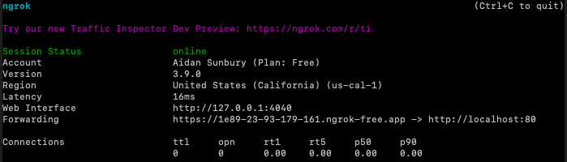

import Tabs from "@theme/Tabs";
import TabItem from "@theme/TabItem";

# APIs and Webhooks

## Assignment Links

## Assignment Overview

### Backstory

Your team of junior developers keep on writing code full of silly little mistakes, and they keep merging these mistakes before you get a chance to review their code. You want to make sure that you see and review every pull request before it gets merged, and so decide to write a script that will automatically assign yourself as a reviewer to every pull request that is opened. But, to keep morale high, you will also automatically leave a comment on every pull request that is opened, thanking the author for their hard work.

### Motivation

In almost all real world software applications, you need to be able to work with external systems. If you want to accept payments, you will have to integrate with Stripe. If you want to send emails, you will likely have to integrate with a provider like Twilio. This assignment teaches you how to interact with an external system (GitHub) both using its API and its webhooks.

## Part 1: GitHub Setup

In order to programmatically interact with GitHub, you will need to create a personal access token. This token will be used to authenticate your scripts when they make requests to the GitHub API. You can think of this token as a password that you are sharing with your script, so make sure to keep it safe.

1. Navigate to your GitHub settings > Developer settings > Personal access tokens > Fine-grained tokens or [click here](https://github.com/settings/tokens?type=beta).
2. Click on the "Generate new token" button. Name you token and give it an expiration of at least 30 days.
3. For Resource owner, select CS61D
4. For Repository Access, select "Only select repositories", and then select the repository you generated for the assignment.
5. Under Repository permissions, select "Read and Write" for Pull requests, and "Read-only" for Metadata. It is always good practice to give the least amount of permissions necessary to accomplish your goals, minimizing the potential damage if your token is compromised.
6. Click "Generate token" and copy the token that is generated. **This token will not be shown again, so make sure to save it in your local .env file.**

## Part 2: GitHub API Scripts

Before writing any code, ensure that you have installed the necessary dependencies by running:

```bash
bun install
```

And create a **.env** file from the template with your personal access token.

Now that we can programmatically interact with GitHub, we can begin writing the scripts that we will use in our automation. We will be using GitHub's [node.js SDK](https://github.com/octokit/octokit.js), which maps to the functionality described in the [GitHub API documentation](https://docs.github.com/en/rest).

For example, if I wanted to [create an issue](https://docs.github.com/en/rest/issues/issues?apiVersion=2022-11-28#create-an-issue), then I would use the following code from the sdk:

```typescript
// Define the octokit client
const octokit = new Octokit({
  auth: "your-personal-access-token",
});
const responseObject = await octokit.rest.issues.create({
  owner: "CS61D", // Note, all repositories created for this assignment will be under the CS61D organization
  repo: "MyRepo",
  title: "New issue",
  body: "This is a new issue",
});
```

The SDK is fully type safe, and therefore you will get autocompletion and type checking when you use it. This makes it much easier to write code that interacts with the GitHub API.

### Get Issues for a Repository

Fill in **getPRs.ts** to return all pull requests for a given repository. First, identify the endpoint that you will need to use to list all pull requests for a repository. Then, use the octokit client to make a request to that endpoint and return the response.

You can test your function by running the script in the terminal and logging the output:

```bash
bun run scripts/getPRs.ts
```

<details>
<summary>
If there are any open PRs in the repository, you should see some output in the terminal that looks something like this
</summary>
```console
[
  {
    url: "https://api.github.com/repos/CS61D/Assignment-Solution-APIs-and-Webhooks/pulls/7",
    id: 1879275492,
    node_id: "PR_kwDOL7ufT85wA3fk",
    html_url: "https://github.com/CS61D/Assignment-Solution-APIs-and-Webhooks/pull/7",
    diff_url: "https://github.com/CS61D/Assignment-Solution-APIs-and-Webhooks/pull/7.diff",
    patch_url: "https://github.com/CS61D/Assignment-Solution-APIs-and-Webhooks/pull/7.patch",
    issue_url: "https://api.github.com/repos/CS61D/Assignment-Solution-APIs-and-Webhooks/issues/7",
    number: 7,
    state: "open",
    locked: false,
    title: "Branch1 more testing",
    user: {
      login: "aidansunbury",
      id: 64103161,
      node_id: "MDQ6VXNlcjY0MTAzMTYx",
      avatar_url: "https://avatars.githubusercontent.com/u/64103161?v=4",
      gravatar_id: "",
      url: "https://api.github.com/users/aidansunbury",
      html_url: "https://github.com/aidansunbury",
      followers_url: "https://api.github.com/users/aidansunbury/followers",
      following_url: "https://api.github.com/users/aidansunbury/following{/other_user}",
      gists_url: "https://api.github.com/users/aidansunbury/gists{/gist_id}",
      starred_url: "https://api.github.com/users/aidansunbury/starred{/owner}{/repo}",
      subscriptions_url: "https://api.github.com/users/aidansunbury/subscriptions",
      organizations_url: "https://api.github.com/users/aidansunbury/orgs",
      repos_url: "https://api.github.com/users/aidansunbury/repos",
      events_url: "https://api.github.com/users/aidansunbury/events{/privacy}",
      received_events_url: "https://api.github.com/users/aidansunbury/received_events",
      type: "User",
      site_admin: false,
    },
    body: null,
    created_at: "2024-05-20T23:48:04Z",
    updated_at: "2024-05-21T01:48:46Z",
    closed_at: null,
    merged_at: null,
    merge_commit_sha: null,
    assignee: null,
    assignees: [],
    requested_reviewers: [
      [Object ...], [Object ...]
    ],
    requested_teams: [],
    labels: [],
    milestone: null,
    draft: false,
    commits_url: "https://api.github.com/repos/CS61D/Assignment-Solution-APIs-and-Webhooks/pulls/7/commits",
    review_comments_url: "https://api.github.com/repos/CS61D/Assignment-Solution-APIs-and-Webhooks/pulls/7/comments",
    review_comment_url: "https://api.github.com/repos/CS61D/Assignment-Solution-APIs-and-Webhooks/pulls/comments{/number}",
    comments_url: "https://api.github.com/repos/CS61D/Assignment-Solution-APIs-and-Webhooks/issues/7/comments",
    statuses_url: "https://api.github.com/repos/CS61D/Assignment-Solution-APIs-and-Webhooks/statuses/f526040c5a1643a4b0142b0ef1065893df3664fd",
    head: {
      label: "CS61D:branch1",
      ref: "branch1",
      sha: "f526040c5a1643a4b0142b0ef1065893df3664fd",
      user: [Object ...],
      repo: [Object ...],
    },
    base: {
      label: "CS61D:main",
      ref: "main",
      sha: "9013360024d79f672935f6f6977ae09a27311058",
      user: [Object ...],
      repo: [Object ...],
    },
    _links: {
      self: [Object ...],
      html: [Object ...],
      issue: [Object ...],
      comments: [Object ...],
      review_comments: [Object ...],
      review_comment: [Object ...],
      commits: [Object ...],
      statuses: [Object ...],
    },
    author_association: "CONTRIBUTOR",
    auto_merge: null,
    active_lock_reason: null,
  }
]
```
</details>

:::note
The response will contain lots of metadata about the request, such as the status, request url, and headers. For this function, we only want to return the data that is relevant to the PRs, such as the PR number, title, and author. To do this, return just the data property on the response object. If you are not getting any type errors on your return statement, you are returning the correct data.
:::

### Request Review and Leave a Comment

Fill in **reviewAndComment.ts**. First check if the requested reviewer is already added, and make sure that the requested reviewer is not the author of the PR. If the reviewer is not already added, add the reviewer to the PR. Then, leave a comment on the PR thanking the author for their hard work. The comment can contain any text you like.

:::note
For this assignment, you can request review from the Codify-Education organizational account.\
:::

:::tip
Take advantage of the fact that the octokit SDK is fully type safe. If you are not sure what properties are available on a PR object, you can use the TypeScript autocompletion to explore the object. For example, if you have a PR object, you can type `pr.` and see all of the available properties and methods on the object.
:::

### Combining the Scripts

Fill in your repository name in **reviewRequestAll.ts**. Create a few branches from your repository (you can do this by making changes to scratch.txt) and make pull requests from these branches. Then, run the script to request review and leave a comment on all open PRs in your repository.

```bash
bun run scripts/reviewRequestAll.ts
```

If the script worked, you should see the comments and review requests on the PRs in your repository.

## Part 3: Setting up the Webhook

Our script is useful enough, but we would have to run it over and over again to make sure that every PR is reviewed. Instead, we can set up a webhook that will automatically run our script every time a pull request is opened. This will save resources, and make sure that review is instantly requested every time a PR is opened.

GitHub can not send information directly to our localhost. We need to give it a live URL that it can send information to, which we can then forward to our localhost. We will use a tool called [ngrok](https://ngrok.com/) to create a tunnel to our localhost.

### Installing ngrok

<Tabs>
  <TabItem value="Windows" label="Windows" default>
    ```bash 
    choco install ngrok
    ```
  </TabItem>
  <TabItem value="Mac" label="Mac">
    ```bash 
    brew install ngrok/ngrok/ngrok
    ```
  </TabItem>
</Tabs>

After installing, we can start a tunnel to our localhost by running the following command:

```bash
ngrok http 80
```

And you should see an output like this in your terminal:



Now all requests sent to https://1e89-23-93-179-161.ngrok-free.app will be forwarded to your localhost on port 80.

:::note
Because we are using the free version of ngrok, this URL wil change every time you restart the tunnel. Either keep the same process running throughout the entire time you are working on the assignment, or update the webhook URL in GitHub every time you restart the tunnel.
:::

### Setting up the Webhook

1. Navigate to your repository on GitHub. Click settings > Webhooks > Add webhook.
2. For the Payload URL, enter the URL that ngrok is forwarding to your localhost.
3. For Content type, select application/json.
4. For the events, select "Let me select individual events" and then check the only "Pull requests" box.
5. Click "Add webhook".

Now, every time a pull request related event happens in your repository, GitHub will send a POST request to the URL that ngrok is forwarding to your localhost. Now we can configure our script to run automatically every time a pull request is opened.

## Part 4: Using the webhook

The **index.ts** file is an [express server](https://expressjs.com/), which listens on port 80 for incoming POST requests. When a POST request is received, the server will log the request body to the console.

Start the server by running:

```bash
bun index.ts
```

Now check that we can receive the webhook. Open or close a PR in your chosen repository, and you should see some terminal logs. Now, call your **requestReview** function to test if your script works! If everything is set up correctly, your script should run every time a PR is opened.
