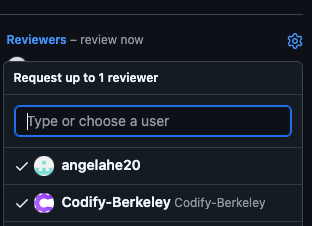

import Tabs from "@theme/Tabs";
import TabItem from "@theme/TabItem";

# 9. APIs and Webhooks

## Assignment Links

* [Starter Code](https://github.com/CS61D/Assignment-Starter-APIs-and-Webhooks)
* [Finished Solution](https://github.com/CS61D/Webhooks-Assignment-Sample-Repo): leave a PR on this repo and see what happens

## Assignment Overview

Your are a senior developer leading a team of junior developers keep on writing code full of silly little mistakes. Worse, they keep merging these mistakes before you get a chance to review their code. You want to make sure that you see and review every pull request before it gets merged, and so decide to write a script that will automatically assign yourself as a reviewer to every pull request that is opened. But, to keep morale high, you will also automatically leave a comment on every pull request that is opened, thanking the author for their hard work.

### Motivation

In almost all real world software applications, you need to be able to work with external systems. If you want to accept payments, you will have to integrate with Stripe. If you want to send emails, you will likely have to integrate with a provider like Twilio. This assignment teaches you how to interact with an external system (GitHub) both using its API and its webhooks.

### Setup

Install the dependencies:
  
```bash
bun install
```

And create a local .env file from the template
```bash
cp .env.example .env
```

## Part 1: GitHub Setup

In order to programmatically interact with GitHub, you will need to create a personal access token. This token will be used to authenticate your scripts when they make requests to the GitHub API. You can think of this token as a password that you are sharing with your script, so make sure to keep it safe.

1. Navigate to your GitHub settings > Developer settings > Personal access tokens > Fine-grained tokens or [click here](https://github.com/settings/tokens?type=beta).
2. Click on the "Generate new token" button. Name you token and give it an expiration of at least 30 days.
3. For Resource owner, select CS61D
4. For Repository Access, select "Only select repositories", and then select the repository you generated for the assignment.
5. Under Repository permissions, select "Read and Write" for Pull requests, and "Read-only" for Metadata. It is always good practice to give the least amount of permissions necessary to accomplish your goals, minimizing the potential damage if your token is compromised.
6. Click "Generate token" and copy the token that is generated. **This token will not be shown again, so make sure to save it in your local .env file.**


## Part 2: GitHub API Scripts

Now that we can programmatically interact with GitHub, we can begin writing the scripts that we will use in our automation. We will be using GitHub's [node.js SDK](https://github.com/octokit/octokit.js), which maps to the functionality described in the [GitHub API documentation](https://docs.github.com/en/rest).

For example, if I wanted to [create an issue](https://docs.github.com/en/rest/issues/issues?apiVersion=2022-11-28#create-an-issue), then I would use the following code from the sdk:

```typescript
// Define the octokit client
const octokit = new Octokit({
  auth: "your-personal-access-token",
});
const responseObject = await octokit.rest.issues.create({
  owner: "CS61D", // Note, all repositories created for this assignment will be under the CS61D organization
  repo: "MyRepo",
  title: "New issue",
  body: "This is a new issue",
});
```

The SDK is fully type safe, and therefore you will get autocompletion and type checking when you use it. This makes it much easier to write code that interacts with the GitHub API.

The SDK has two ways of making a request, using the `octokit.request` method, or using the `octokit.rest` object. You may choose either for this assignment. The `octokit.request` has examples right in the docs, but the `octokit.rest` object a bit more intuitive to use.

<Tabs>
  <TabItem value="request" label="octokit.request" default>
    ```typescript
    const responseObject = await octokit.request("POST /repos/{owner}/{repo}/issues", {
      owner: "CS61D",
      repo: "MyRepo",
      title: "New issue",
      body: "This is a new issue",
    });
    ```
  </TabItem>
  <TabItem value="rest" label="octokit.rest">
    ```typescript 
    const responseObject = await octokit.rest.issues.create({
      owner: "CS61D", 
      repo: "MyRepo",
      title: "New issue",
      body: "This is a new issue",
    });
    ```
  </TabItem>
</Tabs>

### Part 2.1: Get a Pull Request for a Repository

Fill in `getPR.ts` to return pull requests for a given repository. First, identify the endpoint that you will need to use to list all pull requests for a repository. When searching [the docs](https://docs.github.com/en/rest?apiVersion=2022-11-28), Think about what **resource** you are acting on, and then what **action** you are taking on that action. If you get stuck, the endpoint you need will be in the hint. You will know that you are calling the correct endpoint if the type errors go away on the return the response.

<details>
  <summary>
  Hint: Correct Endpoint
  </summary>

  The endpoint you need is `GET /repos/{owner}/{repo}/pulls/{pull_number}`. You can find it in the [here](https://docs.github.com/en/rest/pulls/pulls?apiVersion=2022-11-28#get-a-pull-request).
</details>

Then, use the octokit client to make a request to that endpoint and return the response.

You can test your function by running the script in the terminal and logging the output (you will have to make at least one pull request on the repository first):

```bash
bun run scripts/getPR.ts
```

<details>
<summary>
If your function is working correctly, you should see output similar to this:
</summary>
```json
{
  url: "https://api.github.com/repos/CS61D/Assignment-Solution-APIs-and-Webhooks/pulls/1",
  id: 1870268659,
  node_id: "PR_kwDOL7ufT85vegjz",
  html_url: "https://github.com/CS61D/Assignment-Solution-APIs-and-Webhooks/pull/1",
  diff_url: "https://github.com/CS61D/Assignment-Solution-APIs-and-Webhooks/pull/1.diff",
  patch_url: "https://github.com/CS61D/Assignment-Solution-APIs-and-Webhooks/pull/1.patch",
  issue_url: "https://api.github.com/repos/CS61D/Assignment-Solution-APIs-and-Webhooks/issues/1",
  number: 1,
  state: "closed",
  locked: false,
  title: "branch1 initial commit",
  user: {
    login: "aidansunbury",
    id: 64103161,
    node_id: "MDQ6VXNlcjY0MTAzMTYx",
    avatar_url: "https://avatars.githubusercontent.com/u/64103161?v=4",
    gravatar_id: "",
    url: "https://api.github.com/users/aidansunbury",
    html_url: "https://github.com/aidansunbury",
    followers_url: "https://api.github.com/users/aidansunbury/followers",
    following_url: "https://api.github.com/users/aidansunbury/following{/other_user}",
    gists_url: "https://api.github.com/users/aidansunbury/gists{/gist_id}",
    starred_url: "https://api.github.com/users/aidansunbury/starred{/owner}{/repo}",
    subscriptions_url: "https://api.github.com/users/aidansunbury/subscriptions",
    organizations_url: "https://api.github.com/users/aidansunbury/orgs",
    repos_url: "https://api.github.com/users/aidansunbury/repos",
    events_url: "https://api.github.com/users/aidansunbury/events{/privacy}",
    received_events_url: "https://api.github.com/users/aidansunbury/received_events",
    type: "User",
    site_admin: false,
  },
  body: null,
  created_at: "2024-05-15T05:02:10Z",
  updated_at: "2024-05-15T06:09:59Z",
  closed_at: "2024-05-15T06:09:59Z",
  merged_at: "2024-05-15T06:09:59Z",
  merge_commit_sha: "ee2014abb804fa768236635b8b273b453b8da03f",
  assignee: null,
  assignees: [],
  requested_reviewers: [],
  requested_teams: [],
  labels: [],
  milestone: null,
  draft: false,
  commits_url: "https://api.github.com/repos/CS61D/Assignment-Solution-APIs-and-Webhooks/pulls/1/commits",
  review_comments_url: "https://api.github.com/repos/CS61D/Assignment-Solution-APIs-and-Webhooks/pulls/1/comments",
  review_comment_url: "https://api.github.com/repos/CS61D/Assignment-Solution-APIs-and-Webhooks/pulls/comments{/number}",
  comments_url: "https://api.github.com/repos/CS61D/Assignment-Solution-APIs-and-Webhooks/issues/1/comments",
  statuses_url: "https://api.github.com/repos/CS61D/Assignment-Solution-APIs-and-Webhooks/statuses/f526040c5a1643a4b0142b0ef1065893df3664fd",
  head: {
    label: "CS61D:branch1",
    ref: "branch1",
    sha: "f526040c5a1643a4b0142b0ef1065893df3664fd",
    user: {
      login: "CS61D",
      id: 168786801,
      node_id: "O_kgDOCg97cQ",
      avatar_url: "https://avatars.githubusercontent.com/u/168786801?v=4",
      gravatar_id: "",
      url: "https://api.github.com/users/CS61D",
      html_url: "https://github.com/CS61D",
      followers_url: "https://api.github.com/users/CS61D/followers",
      following_url: "https://api.github.com/users/CS61D/following{/other_user}",
      gists_url: "https://api.github.com/users/CS61D/gists{/gist_id}",
      starred_url: "https://api.github.com/users/CS61D/starred{/owner}{/repo}",
      subscriptions_url: "https://api.github.com/users/CS61D/subscriptions",
      organizations_url: "https://api.github.com/users/CS61D/orgs",
      repos_url: "https://api.github.com/users/CS61D/repos",
      events_url: "https://api.github.com/users/CS61D/events{/privacy}",
      received_events_url: "https://api.github.com/users/CS61D/received_events",
      type: "Organization",
      site_admin: false,
    },
    repo: {
      id: 800825167,
      node_id: "R_kgDOL7ufTw",
      name: "Assignment-Solution-APIs-and-Webhooks",
      full_name: "CS61D/Assignment-Solution-APIs-and-Webhooks",
      private: true,
      owner: [Object ...],
      html_url: "https://github.com/CS61D/Assignment-Solution-APIs-and-Webhooks",
      description: null,
      fork: false,
      url: "https://api.github.com/repos/CS61D/Assignment-Solution-APIs-and-Webhooks",
      forks_url: "https://api.github.com/repos/CS61D/Assignment-Solution-APIs-and-Webhooks/forks",
      keys_url: "https://api.github.com/repos/CS61D/Assignment-Solution-APIs-and-Webhooks/keys{/key_id}",
      collaborators_url: "https://api.github.com/repos/CS61D/Assignment-Solution-APIs-and-Webhooks/collaborators{/collaborator}",
      teams_url: "https://api.github.com/repos/CS61D/Assignment-Solution-APIs-and-Webhooks/teams",
      hooks_url: "https://api.github.com/repos/CS61D/Assignment-Solution-APIs-and-Webhooks/hooks",
      issue_events_url: "https://api.github.com/repos/CS61D/Assignment-Solution-APIs-and-Webhooks/issues/events{/number}",
      events_url: "https://api.github.com/repos/CS61D/Assignment-Solution-APIs-and-Webhooks/events",
      assignees_url: "https://api.github.com/repos/CS61D/Assignment-Solution-APIs-and-Webhooks/assignees{/user}",
      branches_url: "https://api.github.com/repos/CS61D/Assignment-Solution-APIs-and-Webhooks/branches{/branch}",
      tags_url: "https://api.github.com/repos/CS61D/Assignment-Solution-APIs-and-Webhooks/tags",
      blobs_url: "https://api.github.com/repos/CS61D/Assignment-Solution-APIs-and-Webhooks/git/blobs{/sha}",
      git_tags_url: "https://api.github.com/repos/CS61D/Assignment-Solution-APIs-and-Webhooks/git/tags{/sha}",
      git_refs_url: "https://api.github.com/repos/CS61D/Assignment-Solution-APIs-and-Webhooks/git/refs{/sha}",
      trees_url: "https://api.github.com/repos/CS61D/Assignment-Solution-APIs-and-Webhooks/git/trees{/sha}",
      statuses_url: "https://api.github.com/repos/CS61D/Assignment-Solution-APIs-and-Webhooks/statuses/{sha}",
      languages_url: "https://api.github.com/repos/CS61D/Assignment-Solution-APIs-and-Webhooks/languages",
      stargazers_url: "https://api.github.com/repos/CS61D/Assignment-Solution-APIs-and-Webhooks/stargazers",
      contributors_url: "https://api.github.com/repos/CS61D/Assignment-Solution-APIs-and-Webhooks/contributors",
      subscribers_url: "https://api.github.com/repos/CS61D/Assignment-Solution-APIs-and-Webhooks/subscribers",
      subscription_url: "https://api.github.com/repos/CS61D/Assignment-Solution-APIs-and-Webhooks/subscription",
      commits_url: "https://api.github.com/repos/CS61D/Assignment-Solution-APIs-and-Webhooks/commits{/sha}",
      git_commits_url: "https://api.github.com/repos/CS61D/Assignment-Solution-APIs-and-Webhooks/git/commits{/sha}",
      comments_url: "https://api.github.com/repos/CS61D/Assignment-Solution-APIs-and-Webhooks/comments{/number}",
      issue_comment_url: "https://api.github.com/repos/CS61D/Assignment-Solution-APIs-and-Webhooks/issues/comments{/number}",
      contents_url: "https://api.github.com/repos/CS61D/Assignment-Solution-APIs-and-Webhooks/contents/{+path}",
      compare_url: "https://api.github.com/repos/CS61D/Assignment-Solution-APIs-and-Webhooks/compare/{base}...{head}",
      merges_url: "https://api.github.com/repos/CS61D/Assignment-Solution-APIs-and-Webhooks/merges",
      archive_url: "https://api.github.com/repos/CS61D/Assignment-Solution-APIs-and-Webhooks/{archive_format}{/ref}",
      downloads_url: "https://api.github.com/repos/CS61D/Assignment-Solution-APIs-and-Webhooks/downloads",
      issues_url: "https://api.github.com/repos/CS61D/Assignment-Solution-APIs-and-Webhooks/issues{/number}",
      pulls_url: "https://api.github.com/repos/CS61D/Assignment-Solution-APIs-and-Webhooks/pulls{/number}",
      milestones_url: "https://api.github.com/repos/CS61D/Assignment-Solution-APIs-and-Webhooks/milestones{/number}",
      notifications_url: "https://api.github.com/repos/CS61D/Assignment-Solution-APIs-and-Webhooks/notifications{?since,all,participating}",
      labels_url: "https://api.github.com/repos/CS61D/Assignment-Solution-APIs-and-Webhooks/labels{/name}",
      releases_url: "https://api.github.com/repos/CS61D/Assignment-Solution-APIs-and-Webhooks/releases{/id}",
      deployments_url: "https://api.github.com/repos/CS61D/Assignment-Solution-APIs-and-Webhooks/deployments",
      created_at: "2024-05-15T04:24:20Z",
      updated_at: "2024-09-12T02:38:15Z",
      pushed_at: "2024-09-20T01:04:27Z",
      git_url: "git://github.com/CS61D/Assignment-Solution-APIs-and-Webhooks.git",
      ssh_url: "git@github.com:CS61D/Assignment-Solution-APIs-and-Webhooks.git",
      clone_url: "https://github.com/CS61D/Assignment-Solution-APIs-and-Webhooks.git",
      svn_url: "https://github.com/CS61D/Assignment-Solution-APIs-and-Webhooks",
      homepage: null,
      size: 38,
      stargazers_count: 1,
      watchers_count: 1,
      language: "TypeScript",
      has_issues: true,
      has_projects: true,
      has_downloads: true,
      has_wiki: false,
      has_pages: false,
      has_discussions: false,
      forks_count: 0,
      mirror_url: null,
      archived: false,
      disabled: false,
      open_issues_count: 4,
      license: null,
      allow_forking: true,
      is_template: false,
      web_commit_signoff_required: false,
      topics: [],
      visibility: "private",
      forks: 0,
      open_issues: 4,
      watchers: 1,
      default_branch: "main",
    },
  },
  base: {
    label: "CS61D:main",
    ref: "main",
    sha: "55bb308783df5dd5e7090214915bfa48d3253bcb",
    user: {
      login: "CS61D",
      id: 168786801,
      node_id: "O_kgDOCg97cQ",
      avatar_url: "https://avatars.githubusercontent.com/u/168786801?v=4",
      gravatar_id: "",
      url: "https://api.github.com/users/CS61D",
      html_url: "https://github.com/CS61D",
      followers_url: "https://api.github.com/users/CS61D/followers",
      following_url: "https://api.github.com/users/CS61D/following{/other_user}",
      gists_url: "https://api.github.com/users/CS61D/gists{/gist_id}",
      starred_url: "https://api.github.com/users/CS61D/starred{/owner}{/repo}",
      subscriptions_url: "https://api.github.com/users/CS61D/subscriptions",
      organizations_url: "https://api.github.com/users/CS61D/orgs",
      repos_url: "https://api.github.com/users/CS61D/repos",
      events_url: "https://api.github.com/users/CS61D/events{/privacy}",
      received_events_url: "https://api.github.com/users/CS61D/received_events",
      type: "Organization",
      site_admin: false,
    },
    repo: {
      id: 800825167,
      node_id: "R_kgDOL7ufTw",
      name: "Assignment-Solution-APIs-and-Webhooks",
      full_name: "CS61D/Assignment-Solution-APIs-and-Webhooks",
      private: true,
      owner: [Object ...],
      html_url: "https://github.com/CS61D/Assignment-Solution-APIs-and-Webhooks",
      description: null,
      fork: false,
      url: "https://api.github.com/repos/CS61D/Assignment-Solution-APIs-and-Webhooks",
      forks_url: "https://api.github.com/repos/CS61D/Assignment-Solution-APIs-and-Webhooks/forks",
      keys_url: "https://api.github.com/repos/CS61D/Assignment-Solution-APIs-and-Webhooks/keys{/key_id}",
      collaborators_url: "https://api.github.com/repos/CS61D/Assignment-Solution-APIs-and-Webhooks/collaborators{/collaborator}",
      teams_url: "https://api.github.com/repos/CS61D/Assignment-Solution-APIs-and-Webhooks/teams",
      hooks_url: "https://api.github.com/repos/CS61D/Assignment-Solution-APIs-and-Webhooks/hooks",
      issue_events_url: "https://api.github.com/repos/CS61D/Assignment-Solution-APIs-and-Webhooks/issues/events{/number}",
      events_url: "https://api.github.com/repos/CS61D/Assignment-Solution-APIs-and-Webhooks/events",
      assignees_url: "https://api.github.com/repos/CS61D/Assignment-Solution-APIs-and-Webhooks/assignees{/user}",
      branches_url: "https://api.github.com/repos/CS61D/Assignment-Solution-APIs-and-Webhooks/branches{/branch}",
      tags_url: "https://api.github.com/repos/CS61D/Assignment-Solution-APIs-and-Webhooks/tags",
      blobs_url: "https://api.github.com/repos/CS61D/Assignment-Solution-APIs-and-Webhooks/git/blobs{/sha}",
      git_tags_url: "https://api.github.com/repos/CS61D/Assignment-Solution-APIs-and-Webhooks/git/tags{/sha}",
      git_refs_url: "https://api.github.com/repos/CS61D/Assignment-Solution-APIs-and-Webhooks/git/refs{/sha}",
      trees_url: "https://api.github.com/repos/CS61D/Assignment-Solution-APIs-and-Webhooks/git/trees{/sha}",
      statuses_url: "https://api.github.com/repos/CS61D/Assignment-Solution-APIs-and-Webhooks/statuses/{sha}",
      languages_url: "https://api.github.com/repos/CS61D/Assignment-Solution-APIs-and-Webhooks/languages",
      stargazers_url: "https://api.github.com/repos/CS61D/Assignment-Solution-APIs-and-Webhooks/stargazers",
      contributors_url: "https://api.github.com/repos/CS61D/Assignment-Solution-APIs-and-Webhooks/contributors",
      subscribers_url: "https://api.github.com/repos/CS61D/Assignment-Solution-APIs-and-Webhooks/subscribers",
      subscription_url: "https://api.github.com/repos/CS61D/Assignment-Solution-APIs-and-Webhooks/subscription",
      commits_url: "https://api.github.com/repos/CS61D/Assignment-Solution-APIs-and-Webhooks/commits{/sha}",
      git_commits_url: "https://api.github.com/repos/CS61D/Assignment-Solution-APIs-and-Webhooks/git/commits{/sha}",
      comments_url: "https://api.github.com/repos/CS61D/Assignment-Solution-APIs-and-Webhooks/comments{/number}",
      issue_comment_url: "https://api.github.com/repos/CS61D/Assignment-Solution-APIs-and-Webhooks/issues/comments{/number}",
      contents_url: "https://api.github.com/repos/CS61D/Assignment-Solution-APIs-and-Webhooks/contents/{+path}",
      compare_url: "https://api.github.com/repos/CS61D/Assignment-Solution-APIs-and-Webhooks/compare/{base}...{head}",
      merges_url: "https://api.github.com/repos/CS61D/Assignment-Solution-APIs-and-Webhooks/merges",
      archive_url: "https://api.github.com/repos/CS61D/Assignment-Solution-APIs-and-Webhooks/{archive_format}{/ref}",
      downloads_url: "https://api.github.com/repos/CS61D/Assignment-Solution-APIs-and-Webhooks/downloads",
      issues_url: "https://api.github.com/repos/CS61D/Assignment-Solution-APIs-and-Webhooks/issues{/number}",
      pulls_url: "https://api.github.com/repos/CS61D/Assignment-Solution-APIs-and-Webhooks/pulls{/number}",
      milestones_url: "https://api.github.com/repos/CS61D/Assignment-Solution-APIs-and-Webhooks/milestones{/number}",
      notifications_url: "https://api.github.com/repos/CS61D/Assignment-Solution-APIs-and-Webhooks/notifications{?since,all,participating}",
      labels_url: "https://api.github.com/repos/CS61D/Assignment-Solution-APIs-and-Webhooks/labels{/name}",
      releases_url: "https://api.github.com/repos/CS61D/Assignment-Solution-APIs-and-Webhooks/releases{/id}",
      deployments_url: "https://api.github.com/repos/CS61D/Assignment-Solution-APIs-and-Webhooks/deployments",
      created_at: "2024-05-15T04:24:20Z",
      updated_at: "2024-09-12T02:38:15Z",
      pushed_at: "2024-09-20T01:04:27Z",
      git_url: "git://github.com/CS61D/Assignment-Solution-APIs-and-Webhooks.git",
      ssh_url: "git@github.com:CS61D/Assignment-Solution-APIs-and-Webhooks.git",
      clone_url: "https://github.com/CS61D/Assignment-Solution-APIs-and-Webhooks.git",
      svn_url: "https://github.com/CS61D/Assignment-Solution-APIs-and-Webhooks",
      homepage: null,
      size: 38,
      stargazers_count: 1,
      watchers_count: 1,
      language: "TypeScript",
      has_issues: true,
      has_projects: true,
      has_downloads: true,
      has_wiki: false,
      has_pages: false,
      has_discussions: false,
      forks_count: 0,
      mirror_url: null,
      archived: false,
      disabled: false,
      open_issues_count: 4,
      license: null,
      allow_forking: true,
      is_template: false,
      web_commit_signoff_required: false,
      topics: [],
      visibility: "private",
      forks: 0,
      open_issues: 4,
      watchers: 1,
      default_branch: "main",
    },
  },
  _links: {
    self: {
      href: "https://api.github.com/repos/CS61D/Assignment-Solution-APIs-and-Webhooks/pulls/1",
    },
    html: {
      href: "https://github.com/CS61D/Assignment-Solution-APIs-and-Webhooks/pull/1",
    },
    issue: {
      href: "https://api.github.com/repos/CS61D/Assignment-Solution-APIs-and-Webhooks/issues/1",
    },
    comments: {
      href: "https://api.github.com/repos/CS61D/Assignment-Solution-APIs-and-Webhooks/issues/1/comments",
    },
    review_comments: {
      href: "https://api.github.com/repos/CS61D/Assignment-Solution-APIs-and-Webhooks/pulls/1/comments",
    },
    review_comment: {
      href: "https://api.github.com/repos/CS61D/Assignment-Solution-APIs-and-Webhooks/pulls/comments{/number}",
    },
    commits: {
      href: "https://api.github.com/repos/CS61D/Assignment-Solution-APIs-and-Webhooks/pulls/1/commits",
    },
    statuses: {
      href: "https://api.github.com/repos/CS61D/Assignment-Solution-APIs-and-Webhooks/statuses/f526040c5a1643a4b0142b0ef1065893df3664fd",
    },
  },
  author_association: "CONTRIBUTOR",
  auto_merge: null,
  active_lock_reason: null,
  merged: true,
  mergeable: null,
  rebaseable: null,
  mergeable_state: "unknown",
  merged_by: {
    login: "aidansunbury",
    id: 64103161,
    node_id: "MDQ6VXNlcjY0MTAzMTYx",
    avatar_url: "https://avatars.githubusercontent.com/u/64103161?v=4",
    gravatar_id: "",
    url: "https://api.github.com/users/aidansunbury",
    html_url: "https://github.com/aidansunbury",
    followers_url: "https://api.github.com/users/aidansunbury/followers",
    following_url: "https://api.github.com/users/aidansunbury/following{/other_user}",
    gists_url: "https://api.github.com/users/aidansunbury/gists{/gist_id}",
    starred_url: "https://api.github.com/users/aidansunbury/starred{/owner}{/repo}",
    subscriptions_url: "https://api.github.com/users/aidansunbury/subscriptions",
    organizations_url: "https://api.github.com/users/aidansunbury/orgs",
    repos_url: "https://api.github.com/users/aidansunbury/repos",
    events_url: "https://api.github.com/users/aidansunbury/events{/privacy}",
    received_events_url: "https://api.github.com/users/aidansunbury/received_events",
    type: "User",
    site_admin: false,
  },
  comments: 4,
  review_comments: 0,
  maintainer_can_modify: false,
  commits: 2,
  additions: 346,
  deletions: 1,
  changed_files: 8,
}
```
</details>

:::note
The response will contain lots of metadata about the request, such as the status, request url, and headers. For this function, we only want to return the data that is relevant to the PRs, such as the PR number, title, and author. To do this, return just the `data` property on the response object. If you are not getting any type errors on your return statement, you are returning the correct data.
:::

### Part 2.2: Request Review and Leave a Comment

Fill in `reviewAndComment.ts`. First check if the requested reviewer is already added, and make sure that the requested reviewer is not the author of the PR. If either of these conditions are not met, return without making any changes and `console.log()` which condition wasn't met.

Otherwise, add the passed username as a reviewer on the pull request. Then, leave a comment on the PR thanking the author for their hard work. The comment can contain any text you like, but it must mention the pr author in the comment. After each API call you make, check that the response is `201` and `console.log()` if the request was successful.

:::note
If my username is aidansunbury, all you need to do to mention that user is include the string `@aidansunbury` in the comment. The username of the author of the PR is in the PR object that you get from the `getPR` function.
:::

:::tip
Take advantage of the fact that the octokit SDK is fully type safe. If you are not sure what properties are available on a PR object, you can use the TypeScript autocompletion to explore the object. For example, if you have a PR object, you can type `pr.` TypeScript will show all of the available properties and methods on the object.
:::

<details>
  <summary>
  Hint: Request Reviewer Endpoint
  </summary>

  The endpoint you need is `POST /repos/{owner}/{repo}/pulls/{pull_number}/requested_reviewers`. You can find it in the [here](https://docs.github.com/en/rest/pulls/review-requests?apiVersion=2022-11-28#request-reviewers-for-a-pull-request).
</details>

<details>
  <summary>
  Hint: Create Comment Tip
  </summary>

  Pull requests are technically issues. Find the endpoint to create a comment on an issue.
</details>

<details>
  <summary>
  Hint: Create Comment Endpoint
  </summary>

 The endpoint you need is `POST /repos/{owner}/{repo}/issues/{issue_number}/comments`. You can find it in the [here](https://docs.github.com/en/rest/issues/comments?apiVersion=2022-11-28#create-an-issue-comment).
 </details>

### Part 2.3: Combining the Scripts

You can't test out your reviewAndComment function without a PR to test it on. Fill in your repository name and pull request number in `reviewPullRequest.ts`. Create a branch from your repository (you can do this by making changes to scratch.txt) and a pull request from the branch. Then, run the script to request review and leave a comment on a pull request.

```bash
bun run scripts/reviewPullRequest.ts
```

If the script worked, you should see the comments and review requests on the PRs in your repository.

Also try running your script multiple times on the same PR. If we have handled edge cases correctly, the script should be [idempotent](https://developer.mozilla.org/en-US/docs/Glossary/Idempotent), meaning that running the script multiple times should not have any additional effects after the first run. This is important because requests often fail and are retried multiple times. We want to make sure that we don't accidentally request a review multiple times.

:::note
If we wanted to be more thorough, there are many additional edge cases we could check. For instance, our script could successfully request review, but not leave a comment, leaving the script in an inconsistent state. 
:::

Also make sure that our script does not request the review of the PR author. To test this, change the `GITHUB_USERNAME` in the `.env` file to your GitHub username, and run the script. The script should not request a review from you, since you created the pull request.

<details>
  <summary>
  Fun GitHub Glitch
  </summary>

Now that you are comfortable working interfacing with applications through APIs, you may rarely encounter situations it gives you superpowers. Developers are lazy, and sometimes limit your permissions only through the GUI, without enforcing restrictions on the server. If you don't have GitHub enterprise, you normally are not allowed to request more than one reviewer on a PR in a private repository. However, as of September 9th 2024 (when I last checked), you **can** request as multiple reviewers in private repositories through the API. Try request both `aidansunbury` and `Codify-Berkeley` as reviewers on the your PR, first through the website ui, and then using your script. 



Request up to one reviewer, unless you took 61D 😎

 </details>

## Part 3: Setting up the Webhook

Our script gets the job done, but having to run it manually doesn't actually save us any effort. Instead, we can set up a webhook that will automatically run our script every time a pull request is opened. 

GitHub can not send information directly to our localhost. We need to give it a live URL that it can send information to, which we can then forward to our localhost. We will use a tool called [ngrok](https://ngrok.com/) to create a tunnel to our localhost.

### Installing ngrok

<Tabs>
  <TabItem value="Windows" label="Windows" default>
    ```bash 
    choco install ngrok
    ```
  </TabItem>
  <TabItem value="Mac" label="Mac">
    ```bash 
    brew install ngrok/ngrok/ngrok
    ```
  </TabItem>
</Tabs>

After installing, we can start a tunnel to our localhost by running the following command:

```bash
ngrok http 80
```

And you should see an output like this in your terminal:


Now all requests sent to the **forwarding address** displayed in your terminal (something like https://1e89-23-93-179-161.ngrok-free.app) will be forwarded to your localhost on port 80.

:::caution
Because we are using the free version of ngrok, this URL wil change every time you restart the tunnel. Either keep the same process running throughout the entire time you are working on the assignment (recommended), or update the webhook URL in GitHub every time you restart the tunnel.
:::

### Setting up the Webhook on GitHub

1. Navigate to your repository on GitHub. Click settings > Webhooks > Add webhook.
2. For the Payload URL, enter your forwarding address.
3. For Content type, select application/json.
4. For the events, select "Let me select individual events" and then check the only "Pull requests" box.
5. Click "Add webhook".

Now, every time a pull request related event happens in your repository, GitHub will send a POST request to the URL that ngrok is forwarding to your localhost. Now we can configure our script to run automatically every time a pull request is opened.

## Part 4: Using the webhook

The **index.ts** file is an [express server](https://expressjs.com/), which listens on port 80 for incoming POST requests. When a POST request is received, the server will log the request body to the console.

Look over the code that is in the **index.ts** file. You can see that we respond with a `202` code immediately upon receiving the request and before processing. This ensures that GitHub knows that we received the request and will not time out while waiting for a response. 

Next we check what type of event the webhook is sending us. We specified that we only want to receive pull request events, but in case our webhook was misconfigured, we want to be sure that we are only processing pull request events. 

Then we narrow further, to only process pull requests when they are opened or reopened. This again makes sure we don't run our script when we don't want to.

Finally, fill in a call to your `requestReview` function. The payload of the webhook will be a PR, and have the same structure as what was returned from our `getPR` function. 

Start the server by running:

```bash
bun start
```

Now check that we can receive the webhook. Open a PR in your chosen repository. You should see terminal logs as the webhook is processed, and you should see the reviewer requested and the comment made on the PR on GitHub.

## Part 5: Securing the Webhook

Try running this command in your terminal while the server is running:

```bash
curl -X POST \
  http://localhost:80/ \
  -H "Content-Type: application/json" \
  -H "x-github-event: pull_request" \
  -H "x-hub-signature-256: sha256=fakesignature1234567890abcdef" \
  -d '{
    "action": "opened",
    "pull_request": {
      # highlight-next-line
      "number": 1,
      "title": "Fake Pull Request",
      "user": {
      # highlight-next-line
        "login": "aidansunbury"
      },
      "requested_reviewers": [],
      "base": {
        "repo": {
          # highlight-next-line
          "name": "Assignment-Solution-APIs-and-Webhooks",
          "owner": {
            "login": "CS61D"
          }
        }  
      }
    }
  }'
```

This sends a `POST` request to our server that looks the similar to a to the request that GitHub would send us. 

Try updating the pull request number, user login (to your GitHub username), or and repo name. Remove all reviewers on the pull request, and then run the command. You should be able to get your server to leave the comment and request review on the PR, even though GitHub never sent us a webhook event.

In this scenario, getting our server to erroneously leave a comment and request a reviewer is not the end of the world, but you can imagine a scenario where this vulnerability could be a major issue. Payment processors like Stripe can webhooks to notify your server of a successful payments. You wouldn't want someone to be able to trick your server into thinking that a payment was made when it wasn't.

Fortunately, there is a relative simple fix. We just need to give GitHub a secret key, that only we and GitHub know. GitHub will use this key to ***sign*** the payload of the webhook, and we can use this key to verify that the payload was not tampered with. It is cryptographically impossible to generate a valid signature without knowing the secret key.

### Part 5.1: Generate a Key

Use openssl to generate a key. Run the following command in your terminal:

```bash
openssl rand -base64 32
```

Copy the output of this command and paste it into the `.env` file as the value of `GITHUB_WEBHOOK_SECRET`.

Go back to your webhook settings on your for your GitHub repo. Click `Edit` on your existing webhook, paste the secret key into the `Secret` field, and save your changes.

### Part 5.2: Verify the Incoming Webhook Events

Use this code snippet to pass your secret key to SDK's webhook object:

```typescript
const WEBHOOK_SECRET: string = Bun.env.GITHUB_WEBHOOK_SECRET as string;
const webhooks = new Webhooks({
	secret: WEBHOOK_SECRET,
});
```

This only has to run once, so you can put it above the `app.post` call in the `index.ts` file.


Then paste the following code into the `index.ts` file under `TODO Part 5: Verify Signature`:

```typescript
const signature = request.headers["x-hub-signature-256"] as string;
const isValid = await webhooks.verify(request.body, signature);
```

This reads the signature from the request headers, and then uses the webhook object's `verify` function to check if the signature is valid. `isValid` will be `true` if the signature is valid, and `false` if it is not.

If the webhook is invalid, respond with status code `401`, log an error message, and return to prevent any more code from executing. If the webhook is valid, continue processing the webhook as before.

Retry the `curl` command from Part 5. You should see that the request is rejected with a `401` status code. Also retry triggering a valid webhook event from GitHub. You should see that the request is accepted and processed as before.

Congratulations! You have successfully secured your webhook.