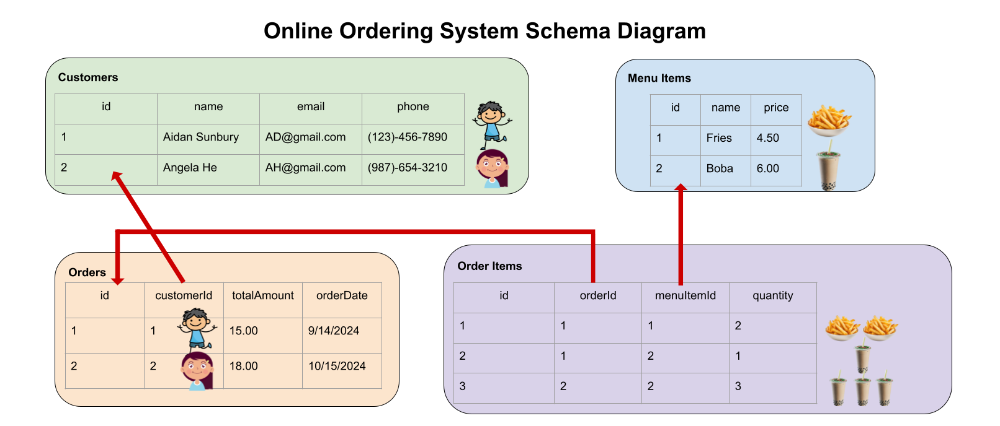

# 6. Databases

## Project Description - The Online Ordering System

Imagine you are developing the backend for a simpler version of an online ordering system like Snackpass for one specific restaurant. The system needs to handle different entities such as customers, orders, menu items, and some order details. This system will allow customers to register customer information, browse the menu, and place orders. It will also allow the restaurant owner to track each day's total sales. How should we go about implementing the backend database system from scratch? We broke it down to 3 parts in this assignment. The first two parts can be completed after the first lecture. The last part can be completed after the second lecture.

- You will start by creating the schema given our context with specific requirements.
- You will then learn to perform CRUD operations on the database by writing functions, validating the data, and doing migrations.
- You will also get to try writing more complicated/advanced functions that mimic real-life operations.

We will walk through the setup for the schema and some example questions in the lab together and we will leave the rest as homework.
In this assignment, we'd also like for you to practice reading through documentation and example code by yourself. We've provided links to the documentation of any relevant operations you will be working with in each section, and it should be pretty straightforward to find what you need. We will also give you some hints and guidance along the way. However, as you go on to work on your own projects in the future, you will often have to navigate through lengthy documentation by yourself. Now is the time to get some practice!

### Tech Stack

- Drizzle ORM + Drizzle Kit
- SQLite
- Zod

### Objectives

- Learn to set up a database schema using an ORM like Drizzle
- Learn to write functions to interact with a database
- Learn to validate data with Zod to ensure data integrity
- Learn to perform database migrations to keep our database schema updated

### Setup

To get started, accept the assignment on Github Classroom and clone the repository to your folder locally.

Install the [dependencies](../glossary#dependency) and create the database files:

```bash
bun install
mkdir db
touch db/database.sqlite db/testdb.sqlite
bun db:push
```

:::note
If you are working on a project with a sqlite database, it is not good practice to commit the database file to GitHub.
:::

When you are ready, run tests:

```bash
bunx vitest src/tests/test_file_name.test.ts
```

:::note
You might see yourself failing a lot of tests when you run bun vitest for all test files. Don't worry, this might be due to concurrency issues with the test files operating on the test database "at the same time", leading to errors. We recommend you run bun vitest on specific test files to see if you've passed the tests. For example, if you've finished writing the CRUD functions for the customers table, you can run `bunx vitest src/tests/customerCRUD.test.ts`.
:::

Feel free to test your code by adding functions in the src/index.ts file. To run:

```bash
bun run src/index.ts
```

There are 3 folders you need to focus on:

1. **Schemas**:

   - **File**: `schemas/schema.ts`
   - **Task**: Define the schema in this file.

2. **Functions**:

   - **Files**: `functions/crud.ts` and `functions/advanced.ts`
   - **Tasks**:
     - Create your CRUD operations in `functions/crud.ts`.
     - Implement advanced operations in `functions/advanced.ts`.

3. **Tests**:
   - **Folder**: `tests/`
   - **Task**: We have defined some tests to ensure your code works properly. Feel free to take a look at the tests to see what edge cases we test for.

## Part 1: Schema Definitions

### Defining Tables

With the specific requirements for each table below, let's first define the schema for our database in the `schemas/schema.ts` file. You might find the Drizzle documentation on **[data types](https://orm.drizzle.team/docs/column-types/sqlite)** and **[constraints](https://orm.drizzle.team/docs/indexes-constraints)** in SQLite helpful for your reference. Make sure to look at the documentation for SQLite, not MySQL or PostgreSQL!

:::note
When you define your sqlite tables, you will need to pass in a string as the sqlite name for each table and each field. To see what convention you should use to label your table's field names, make sure to check out the **beforeAll()** call at the very top of any of the test files. This should give you some clues as to how to define your tables as well!
For example, in the `orders` table, the sqlite name of the field total amount should be labeled as `'total_amount'` and not `'totalAmount'` or any other form.
Locally, you can name the variable referring to this field whatever you like as long as you keep it consistent. For example, `totalAmount: real("total_amount").notNull()` is totally fine.
This is usually not necessary but, because we don't have a test that checks for the correctness of your schema, we manually create a table in the tests and assume that your schema follows the same naming scheme and has the same fields and constraints.
:::

#### Customers `customerSchema`

- `id`: (integer) The primary key of the table that automatically increments.
- `name`: (string) The name of the customer. Must be a non-empty string.
- `email`: (string) The email address of the customer. Must be a non-empty string. Must be in the form of a valid email address.
- `phone`: (string) The phone number of the customer. Must be a non-empty string. Must be UNIQUE!

#### Menu Items `menuItemSchema`

- `id`: (integer) The primary key of the table that automatically increments.
- `name`: (string) The name of the menu item. Must be a non-empty string. Must be UNIQUE!
- `price`: (real number) The price of the menu item. Must be a positive number.

#### Orders `orderSchema`

- `id`: (integer) The primary key of the table that automatically increments.
- `customerId`: (integer) The ID of the customer who placed this order. This is a foreign key.
- `totalAmount`: (real number) The total amount of the order. Must be a positive number.
- `orderDate`: (string) The date of the order. Must be in the format `YYYY-MM-DD`.

#### Order Items `orderItemSchema`

- `id`: (integer) The primary key of the table that automatically increments.
- `orderId`: (integer) The ID of the order. Must be a positive number. This is a foreign key.
- `menuItemId`: (integer) The ID of the menu item. Must be a positive number. This is a foreign key.
- `quantity`: (integer) The quantity of the menu item ordered. Must be a positive number.

### Defining Relationships

Now, don't forget to define the relationships between the tables. You might find the Drizzle documentation on **[Drizzle Queries](https://orm.drizzle.team/docs/rqb#declaring-relations)** helpful. The diagram below might help you better understand the relationship we are working with. Specifically:

- One Customer can place multiple Orders, but each Order can only be placed by one Customer.
- One Order can have multiple OrderItems, but each OrderItem is linked to one Order.
- One OrderItem can only be matched to one MenuItem, but each MenuItem can be referenced by multiple OrderItems.



:::tip

Can you find a hidden **many-to-many relationship** in our schema?

Yes, if you look carefully, each `Order` can contain multiple different `Menu Items` and each `Menu Item` can be in multiple different `Orders`! In Drizzle, how do we set up a many-to-many relationship as such? Typically, we set it up by creating a **junction table** (also known as a pivot table) to connect two other tables. In fact, you have already implemented it if you have not realized! In our schema, the `Order Items` table is technically a junction table that contains foreign IDs - `menuItemId` and `orderId` - that reference the `Orders` table and the `Menu Items` table.

:::

:::note
After you write your schema or whenever you make an update to the schema, you should run a database migration with the following command. This will make sure your functions are working with the most update-to-date version of the schema.

```bash
bun drizzle-kit push
```

You will then see a new migration file appear in the migrations folder that documents any changes to the schema that you just pushed.

You might wonder why we are not running the actual drizzle-kit migrate command. Push lets us omit SQL files generation unlike migrate and it's really good for rapid prototyping.
:::

## Part 2: CRUD Functions

Using the schema defined in Part 1, let's write some functions to perform simple CRUD (create, read, update, delete) operations and use Zod to validate the inputs for these functions to ensure data integrity. To save you some time, we have written zod validation for you, but please skim through it to make sure you understand the format for each field. A lot of these functions will look similar so once you've written the CRUD operations for one table, you will likely find it much faster to modify them for the rest of the tables.

You might find the documentation on **[select](https://orm.drizzle.team/docs/select), [insert](https://orm.drizzle.team/docs/insert), [update](https://orm.drizzle.team/docs/update), [delete](https://orm.drizzle.team/docs/delete),** and **[filter](https://orm.drizzle.team/docs/operators)** helpful for your reference.

:::note
Normally, we wouldn't need to pass in a separate `db` parameter into our functions since we will be interacting with a single database instance. However, we have to test your code with a separate clean database so we are passing in this parameter to distinguish between your own database to experiment with and the testing database. You should see that in your `db` folder you have `database.sqlite` and `testdb.sqlite`. You will be writing code to interact with the former.

:::

### Customers

The online ordering system should be able to register new customers and update existing customers. Assume all customers use their phones to register an account and place orders. We will use the customers' phone numbers as their unique identifier.

1. **Create a Customer**

   - **Function**: `createCustomer`
   - **Parameters**:
     - `db`: Database instance.
     - `data`: An object adhering to `customerSchema` (i.e. assume the input argument contains everything required for the customer schema).
   - **Description**: Inserts a new customer into the `customers` table.

2. **Get a Customer by Phone**

   - **Function**: `getCustomerByPhone`
   - **Parameters**:
     - `db`: Database instance.
     - `phone`: A phone number that is unique to each customer
   - **Description**: Returns the customer who uses the given phone number (return the entire customer object).

3. **Update a Customer by Phone**

   - **Function**: `updateCustomerByPhone`
   - **Parameters**:
     - `db`: Database instance.
     - `phone`: Customer's phone number.
     - `data`: An object with fields to update, adhering to `customerSchema`.
   - **Description**: Updates customer details based on their phone number.

4. **Delete a Customer by Phone**
   - **Function**: `deleteCustomerByPhone`
   - **Parameters**:
     - `db`: Database instance.
     - `phone`: Customer's phone number.
   - **Description**: Deletes a customer from the `customers` table by their phone number.

### Menu Items

Your online ordering system should be able to keep track of all items in a menu! You need to be able to add to and update the menu, and the customers need to be able to scan all of the items in the menu.

1. **Create a Menu Item**

   - **Function**: `createMenuItem`
   - **Parameters**:
     - `db`: Database instance.
     - `data`: An object adhering to `menuItemSchema`.
   - **Description**: Inserts a new menu item into the `menuItems` table.

2. **Get a Menu Item by ID**

   - **Function**: `getMenuItemById`
   - **Parameters**:
     - `db`: Database instance.
     - `id`: id of the menu item.
   - **Description**: Retrieves a menu item by its id from the `menuItems` table.

3. **Update a Menu Item by ID**

   - **Function**: `updateMenuItemById`
   - **Parameters**:
     - `db`: Database instance.
     - `id`: the id of the menu item.
     - `data`: An object with fields to update, adhering to `menuItemSchema`.
   - **Description**: Updates menu item details based on its id.

4. **Delete a Menu Item by ID**
   - **Function**: `deleteMenuItemById`
   - **Parameters**:
     - `db`: Database instance.
     - `id`: id of the menu item.
   - **Description**: Deletes a menu item from the `menuItems` table.

### Orders

Your customers are placing order using this system! You need to keep track of who ordered it, how much the meal costs in total, and the time when the order is placed.

1. **Create an Order**

   - **Function**: `createOrder`
   - **Parameters**:
     - `db`: Database instance.
     - `data`: An object adhering to `orderSchema`.
   - **Description**: Inserts a new order into the `orders` table.

2. **Get All Orders**

   - **Function**: `getOrders`
   - **Parameters**:
     - `db`: Database instance.
   - **Description**: Retrieves all orders from the `orders` table.

3. **Get an Order by ID**

   - **Function**: `getOrderById`
   - **Parameters**:
     - `db`: Database instance.
     - `id`: ID of the order.
   - **Description**: Retrieves an order by its ID from the `orders` table.

4. **Update an Order**

   - **Function**: `updateOrder`
   - **Parameters**:
     - `db`: Database instance.
     - `id`: ID of the order.
     - `data`: An object with fields to update, adhering to `orderSchema`.
   - **Description**: Updates order details based on its ID.

5. **Delete an Order**
   - **Function**: `deleteOrder`
   - **Parameters**:
     - `db`: Database instance.
     - `id`: ID of the order.
   - **Description**: Deletes an order from the `orders` table.

### Order Items

When you place an order, you also need to note down which specific items are ordered and how many are ordered. A customer might also add to an existing order or decides to order more of the same item.

1. **Create an Order Item**

   - **Function**: `createOrderItem`
   - **Parameters**:
     - `db`: Database instance.
     - `data`: An object adhering to `orderItemSchema`.
   - **Description**: Inserts a new order item into the `orderItems` table.

2. **Get Order Items by Order ID**

   - **Function**: `getOrderItemsByOrderId`
   - **Parameters**:
     - `db`: Database instance.
     - `orderId`: ID of the order. **Note: this is not the orderItemID!**
   - **Description**: Retrieves all order items for a specific order.

3. **Update an Order Item**

   - **Function**: `updateOrderItem`
   - **Parameters**:
     - `db`: Database instance.
     - `orderId`: ID of the order.
     - `menuItemId`: ID of the menu item.
     - `data`: An object with fields to update, adhering to `orderItemSchema`.
   - **Description**: Updates order item details based on order ID and menu item ID.

4. **Delete Order Items by Order ID**
   - **Function**: `deleteOrderItemsbyOrderId`
   - **Parameters**:
     - `db`: Database instance.
     - `orderId`: ID of the order.
   - **Description**: Deletes all order items for a specific order (in the case the customer waits eternally for their meal and decides to angrily walk out of the restaurant).

## Part 3: Advanced functions

:::warning
Only start this section when you've passed all the tests for the previous parts of the assignment.
:::

Now that you've familiarized yourself with the basic operations we can do on a single table, let's spice things up a little bit! In the following questions, you need to examine closely the relationship between two or more tables, and perform more complicated operations in one function. You might find the Drizzle Documentation helpful for your reference.

### Question 1: Place an Order

- **Function**: `placeOrder`
- **Description**: Places an order for a customer. This function needs to do the following operations in order.

  - Check to see if the customer is already in the customers table. If not, create a new customer (call `createCustomer` from part 2).
  - Calculate the total cost of the order.
  - Create the order (call `createOrder` from part 2).
  - Insert relevant order items (call `createOrderItem` from part 2).

  We will pack all of the operations in a **[database transaction](https://orm.drizzle.team/docs/transactions)** to ensure consistency. By packing operations into a transaction, we make an attempt to work through a series of actions in an "all or nothing" manner. This means that the transaction will succeed only if all sub-operations succeed. If we fail at any point in a transaction, all actions will be revoked so we don't leave the database in an inconsistent state.

:::tip

You might need to get the index of the last object you created and use it in the next operation. Here's how you can do it. Since our primary keys are generated on auto-increment, we can use `lastInsertRowid`. And since this row id has type number | bigint, we need to convert it to a number with `Number()`.

```typescript
customerId = Number(newCustomer.lastInsertRowid); // Get the ID of the newly created customer
```

:::

- **Parameters**:
  - `db`: Database instance.
  - `data`: An object adhering to `placeOrderSchema`, which includes:
    - `customer`: The customer's basic information
      - `name`: The name of the customer placing the order.
      - `email`: The customer's email.
      - `phone`: The customer's phone number.
    - `items`: An array of items to be included in the order. Each item includes:
      - `menuItemId`: The ID of the menu item.
      - `quantity`: The quantity of the menu item ordered.
- **Returns**: An object containing:
  - `success`: A boolean indicating whether the order was placed successfully.
  - `orderId`: The ID of the newly created order.

### Question 2: Retrieve Orders for a Specific Day and Calculate Total Sales

- **Function**: `totalSale`
- **Description**: The restaurant needs to track its daily sales to monitor its financial performance. This function will aggregate the total sales (sum of all orders) for a given date. The function should compute the total sales for all orders placed on that day. The function needs to perform the following steps:

  - Accept a specific date as input (format: YYYY-MM-DD).
  - Retrieve all orders placed on that date.
  - Sum the total amounts of all orders for that day.

- **Parameters**:
  - `db`: Database instance.
  - `data`: An object adhering to `getOrdersForDaySchema`, which includes:
    - `date`: The date for which orders are to be retrieved (in `YYYY-MM-DD` format).
- **Returns**: An object containing:
  - `totalSales`: The total sales amount for the specified date.

### (BONUS) Question 3 : Order Optimizer: Menu Suggestions Based on Order History

- **Function**: `suggestMenuItemsForCustomer`

- **Description**:
  The restaurant wants to provide personalized menu item recommendations to customers based on their past orders. The function will analyze a customer's order history and suggest the top 3 most frequently ordered items as the customer's all time favorite. The function needs to perform the following steps:

  - Fetch the customer’s order history using their phone number.
  - Identify the most frequently ordered menu items in their order history.
  - Return the top 3 most frequently ordered items from the customer’s older history.

<details>
<summary>**HINT 1**: Why might JOIN make your life easier?</summary>

You might find the documentation on **[join operations](https://orm.drizzle.team/docs/joins)** helpful. When you're working with multiple related tables, like `Orders`, `Order Items`, and `Menu Items`, using join operations can be crucial for simplifying your queries and improving performance. Let’s break down why:

    - You need to retrieve a customer’s order history along with the specific items they ordered. If you were to query each table separately (e.g., fetching orders, then fetching orderItems, then fetching menuItems), you would make multiple queries to the database. This would be inefficient and harder to manage. With a join, you can retrieve all the related data in one query.
    - A join operation allows you to bring together the necessary data from multiple tables (like orders, orderItems, and menuItems) in a single result. This is especially useful when you want to count how frequently a customer ordered each menu item.

  </details>

<details>
<summary> **HINT 2**: How specifically can we implement JOIN?</summary>

You can get all the menu items a customer has ordered in the past. By joining the `Order Items` table with the `Order` table (on `orderId`) and then with the `Menu Items` table (on `menuItemId`), you can directly retrieve the items without multiple queries.

</details>
- **Parameters**:

- `db`: Database instance.
- `phone`: The customer’s phone number (used to retrieve their order history).

- **Returns**:
  An array of up to 3 menu item objects (menuItemSchema) representing the recommended items.
