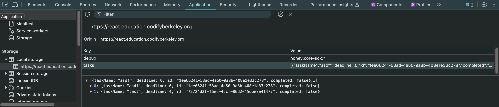

# 3. React

## Assignment Links

- [Starter Code](https://github.com/CS61D/Assignment-Starter-React)
- [Finished Solution](https://todo.61d.org/) (what you will build)
- [Lecture 3: React Basics](https://www.youtube.com/watch?v=uGYfJfQg0sk)
- [Lecture 4: React State and Context](https://www.youtube.com/watch?v=yHFlagmVbB0)

Make sure to watch both lectures before attempting the assignment!

## Assignment Overview

Almost as classic as writing a "Hello World!" program for a new programming language, building a Todo list is a rite of passage for all budding developers. Still, it provides a fantastic opportunity to learn the basics of state management and composing components in React.

First, take a look at the [deployed solution](https://todo.61d.org/) to get a sense of what we will build. First, we will build a todo list that allows users to add, complete, and delete tasks. Then, we will refactor the code to use Context to simplify our state management. And finally, we will persist the state using local storage.

### Setup

Install the dependencies:

```bash
bun install
```

Start the development server:

```bash
bun dev
```

And then view the starter code at [http://localhost:5173/](http://localhost:5173/)

The project is mostly is empty. First, create a `components/` directory within the `src/` directory to store the components we will create. Then, create a `TodoList.tsx` file within the `components/` directory to start building the app. Later, we will use a separate `TodoItem.tsx` component to render each individual todo item after it has been created.

## Part 1: Creating Todo Items

### Part 1.1: Defining the Task Type

It always make sense to start a project by thinking about the data you will work with, and what shape it should take. In this case, there is only one data type we need to define, and that is our `Task` type. In `taskTypes.ts`, create an export an object type `Task` to represent a todo item. Think about the following when defining the properties of a `Task`:

1. What data about a task is visually displayed to a user?
2. Is all of this data required, or should any of it be optional?
3. How will we uniquely identify each task?

After defining your `Task` type, check your definition with the staff solution below.

<details>
  <summary>Solution</summary>

```tsx
export type Task = {
  id: string;
  taskName: string;
  deadline?: number;
  completed: boolean;
};
```

Considerations:

1. We can't use the task name to uniquely identify a task. Also, the index of the task within a list is not a reliable identifier, as it can change when tasks are added or removed. Therefore, we need a unique `id` property for each task.
2. The `deadline` is optional because not all tasks have a deadline. If a task has a deadline, it should be a positive integer representing the number of days until the deadline.
3. Both the deadline and the id could either be strings or numbers, but we will use a string id and a number deadline for consistency.
</details>

### Part 1.2: Getting User Input

In `TodoList.tsx`, create a form with two inputs, and a submit button. The inputs should either have labels that describe what they are for, or placeholders that indicate what should be entered.

Each input should have its value stored in state, and an onChange handler that updates the state when the input changes.

<details>
  <summary>Hint: onChange handlers</summary>

A simple mapping of an input to a state value can be accomplished by setting the new value of the state to `e.target.value` in the onChange handler.

```tsx
const [newTaskName, setNewTaskName] = useState<string>("");
```

```tsx
<input
  type="text"
  placeholder="Enter a task"
  name="task"
  value={newTaskName}
  onChange={(e) => setNewTaskName(e.target.value)}
  required
/>
```

</details>

Check that your form is correctly storing updates to state by rendering the value of the input fields below the form and testing that it updates as you type.

```tsx
<p>Task Name: {newTaskName}</p>
```

Export the component and render it in `App.tsx` to see the form in action.

### Part 1.3: Adding a Task

Create another state object `todoList` to store an array of tasks. Make sure you type it correctly using the `Task` type you defined earlier.

Create a function `addTask` that takes the task name and deadline as arguments, and adds a new task to the todo list by updating the `todoList` state. Add an `onClick` handler to the submit button that to call `addTask`.

To get a unique id for each task, you can use the uuid npm package. These uuids will be unique.

```typescript
import { v4 as uuidv4 } from "uuid";
uuidv4(); // => '9b1deb4d-3b7d-4bad-9bdd-2b0d7b3dcb6d'
```

:::important
After you have updated the `todoList` state, what else should you do to ensure the form is ready for the next task to be added?

How can you ensure that the form is not submitted if the task name is empty?
:::

Make sure to test that the `addTask` function is working correctly by adding a few tasks and checking that they are displayed below the form by JSON stringifying the `todoList` state.

```tsx
<p>{JSON.stringify(todoList)}</p>
```

## Part 2: Rendering Todo Items

Our `TodoList.tsx` component is already getting cluttered, and creating the todos and rendering them represents a logical separation of concerns that makes sense to be handled in different components. Create a new `TodoItem.tsx` component within the `components/` which will be responsible for an individual todo item.

Since we are rendering the `TodoItem` component as a child of the `TodoList` component, we want to keep all of our state hoisted in the `TodoList` component. The `TodoItem` component will not store any of its own state, and instead will receive state and event handlers from its parent component as props.

### Part 2.1: Defining the TaskItem Props

Take a look at the todo items in the [deployed solution](https://todo.61d.org/). What information about a task is displayed in each todo item? What actions can be taken on a task? With this in mind, define a the props for the `TodoItem` component in `TodoItem.tsx`.

<details>
  <summary>Hint 1: Breaking Down the Data</summary>

If you are unsure about what props are needed, consider breaking it down into the data that is needed for display, and the actions that can be taken on the task.

The data is just going to be a `Task` object, but the actions are going to be functions that can be called when a user interacts with the task. What two actions can be taken on a task? What data do these actions need to take in as arguments to identify the task they are acting on?

</details>

<details>
  <summary>Solution (check before moving on)</summary>

```tsx
type TodoItemProps = {
  task: Task;
  handleCompleteTask: (taskNameToComplete: string) => void;
  handleDeleteTask: (taskNameToDelete: string) => void;
};
```

Our two event handlers should take in the task id. They are updating state, so they should not return anything.

</details>

### Part 2.2: Rendering the Task

Based on the data passed in to the `TodoItem` component, render the task name, deadline, and a checkbox to indicate whether the task is completed. Make sure it is clear what each piece of data you are rendering represents.

To add the strike-through effect to the task name when it is completed, you can use the `textDecoration` CSS property. This property can be set to `line-through` to add a line through the text, and `none` to remove it.

```tsx
<span style={{ textDecoration: condition ? "line-through" : "none" }}>
  {/* Text */}
</span>
```

:::note
The task deadline is an optional property. Use conditional rendering to make sure that any text labeling the deadline is only displayed if the deadline is defined.
:::

<details>
  <summary>Rendering a Checkbox</summary>

A checkbox can be rendered by passing `type="checkbox"` to an input element. The `checked` attribute controls whether the checkbox is checked or not.

```tsx
<input type="checkbox" checked={true} />
```

</details>

Make sure that the `TodoItem` component is working correctly by rendering it in the `TodoList` component with some dummy data.

### Part 2.3: Event Handlers and Rendering the List

Bind the passed in event handlers to the checkbox and delete button. The checkbox should call the `handleToggleCompleteTask` function when it is clicked, and the delete button should call the `handleDeleteTask` function. Both of these functions should pass in the task id as an argument.

In `TodoList.tsx`, create the `handleToggleCompleteTask` and `handleDeleteTask` functions. These functions should update the `todoList` state by toggling the `completed` property of the task with the given id, and removing the task with the given id, respectively.

<details>
  <summary>Hint: Deleting an item</summary>

This can be done by filtering the `todoList` state to remove the task with the given id.

</details>

<details>
  <summary>Hint: Toggling a checked item</summary>

This can be done by mapping over the `todoList` state and only changing the task with the given id. To set the completed property to the opposite of its current value, you can use the `!` operator. Ensure that no other properties of the task are changed.

</details>

Finally, render a list of `TodoItem` components in the `TodoList` component. Make sure that the `TodoList` component is passing the correct props to each `TodoItem` component. Congrats! You now have a working todo list.

<details>
  <summary>Hint: Rendering the list</summary>

You can map over the `todoList` state to render a `TodoItem` component for each task. Make sure to pass in the correct props to each `TodoItem` component.

</details>

## Part 3: Refactor to Use Context

Our todo list is rather simple, and we only have to pass state and event handlers down one level. However, any app even slightly more complex than ours will quickly become unwieldy if we have to pass state and event handlers down multiple levels. Context is a way to share state and event handlers across multiple child components without having to pass them down through props.

### Part 3.1: Creating the Context Type

Open `TodoContext.tsx` in the `src/providers/` directory. Notice that we have two defined exports:

1. `TodoProvider` will wrap our application and hold the state and event handlers that we want to access in any child component. Any child component wrapped by the `TodoProvider` will have access to the state and event handlers.
2. `useTodo` is a custom hook that will allow us to access the state and event handlers stored in the `TodoProvider` from any child component. In addition to removing the need to pass props down through multiple levels of components, this hook allows us to only modify our state in predefined ways, making our code easier to read and maintain.

Fill in the `TodoContextType` to define what state and event handlers will be available through the `useTodo` hook. Think about what state in our application is needed in both the `TodoList` and `TodoItem` components. What are the three different places / ways we mutate this state?

Hint: What are the three event handlers we written so far?

Check your solution before moving on to the next step.

<details>
  <summary>Solution</summary>

```tsx
type TodoContextType = {
  tasks: Task[]; // The list of tasks
  // Add task to the list needs the task name and deadline
  addTask: (task: Omit<Task, "id" | "completed">) => void;
  deleteTask: (id: string) => void;
  toggleCompleteTask: (id: string) => void;
};
```

It doesn't make sense to store the state of the task name or deadline inputs in context, since they are only needed locally in the `TodoList` component.

</details>

### Part 3.2: Implementing the Context and Deleting Props

Fortunately, we have already written all of the state logic for our todo list. All we need to do is move this logic into the `TodoProvider` component.

1. Move the `todoList` state and the `addTask`, `deleteTask`, and `toggleCompleteTask` functions into the `TodoProvider` component.
2. Import the `TodoProvider` component into `App.tsx` and wrap the `TodoList` component with it.
3. Import the `useTodo` hook into `TodoList.tsx` and use it to access the `tasks` state and the `addTask` function.

Now, instead of declaring the `todoList` state and the event handlers in the `TodoList` component, we can use the `useTodo` hook to access them.

```tsx
const { tasks, addTask } = useTodo(); // addTask will be a function
```

Finally, remove the passed in `handleToggleCompleteTask` and `handleDeleteTask` props from the `TodoItem` component, and replace them with the `toggleCompleteTask` and `deleteTask` functions from the `useTodo` hook. The `TodoItem` will still need to take in the `task` prop to determine which task to render.

Our refactored code now has the same functionality, but a much cleaner structure.

1. Our complex state management is handled in its own file, reducing the complexity of our `TodoList` component.
2. We now have two fewer props to pass to our `TodoItem` component, making it easier to read and maintain.
3. Future components that need access to the same global state can easily access it by importing the `useTodo` hook.

## Part 4: Persisting State in Local Storage

As a final quality of life improvement, our todo list would be much more useful if it persisted our information even when refreshing the page. For an app as simple as ours, the browser provides a perfect solution, [local storage](https://developer.mozilla.org/en-US/docs/Web/API/Window/localStorage#examples).

The browser's local storage is a key-value store that persists data for a given domain.

```javascript
localStorage.setItem("myKey", "myValue");
localStorage.getItem("myKey"); // => "myValue"
localStorage.removeItem("myKey"); // Removes the key-value pair
```

Local storage is limited to storing strings, but we can get around this by using `JSON.stringify` and `JSON.parse` to convert our objects to strings and back.

```javascript
const tasks = [{ id: "1", taskName: "Do the dishes", deadline: 3, completed: false }];

// Store data
localStorage.setItem("tasks", JSON.stringify(tasks));

// Retrieve data
const storedTasks = JSON.parse(localStorage.getItem("tasks")) as Task[];
```

We could manually update our local storage in every event handler, but this would be repetitive and cumbersome. Instead, we can use the `useEffect` hook to automatically listen for changes to `tasks` and update local storage whenever our `tasks` state changes.

### Part 4.1: Saving State to Local Storage

In the `TodoProvider` component, use the `useEffect` hook to save the `tasks` state to local storage whenever it changes. This will ensure that our tasks are saved even when the page is refreshed.

Make sure to define the dependencies for when this effect should run.

To test that your tasks are being saved, add some tasks, and then pull up the browser's developer tools to inspect the local storage. You should see a key-value pair for `tasks` with the stringified version of your tasks.

1. Right click on the page and select "Inspect" or press `Ctrl + Shift + I`.
2. Go to the "Application" tab.
3. On the left side, you should see a "Local Storage" section. Click on it to see the key-value pairs stored in local storage.

It should look something like this:


### Part 4.2: Loading State from Local Storage

If you refresh the page, you will notice that your tasks are still saved in local storage, but they are not being loaded back into the `tasks` state when the page is refreshed.

To fix this, instead of initializing the `tasks` state to an empty array, initialize it to the tasks stored in local storage. If there are no tasks stored in local storage, the `tasks` state should be initialized to an empty array.

Make sure that you parse the data fetched from local storage setting the state.

Congratulations! You have now built a fully functional todo list that persists tasks even when the page is refreshed.
