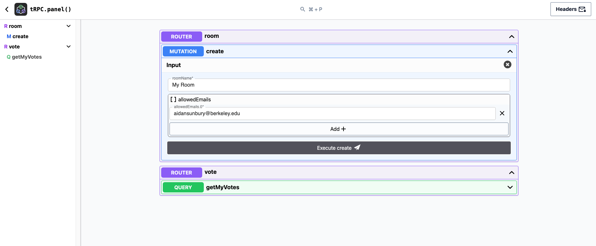
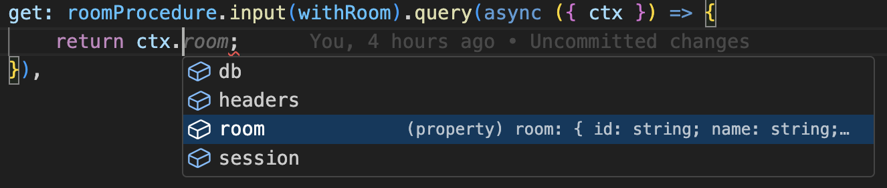

# 7. tRPC, React Query, and Next Auth

## Assignment Links

* [Starter Code](https://github.com/CS61D/Assignment-Starter-tRPC)
* [Finished Solution](https://voting.61d.org/): 

## Assignment Overview

### Backstory

When it comes to big family gatherings or outings with a group of friends, deciding on a restaurant or activity can be a challenging. Everyone has their own ranking of their preferences, and tabulating all of this fairly can be a chore. Therefore, you have decided to build a web application which allows you to implement [ranked choice voting](https://fairvote.org/our-reforms/ranked-choice-voting/).

"Voters have the option to rank candidates in order of preference: first, second, third and so forth. If your first choice doesn’t have a chance to win, your ballot counts for your next choice." --fairvote.org

### Example Vote

Imagine three students are running for class president: Alice, Bob, and Charlie. You are one of five students who get to vote, and the other four voters have already ranked the candidates as follows:

<table>
  <tr>
    <th></th>
    <th>Alice</th>
    <th>Bob</th>
    <th>Charlie</th>
  </tr>
  <tr>
    <td>Voter 1</td>
    <td>1st choice</td>
	<td>2nd choice</td>
	<td>3rd choice</td>
  </tr>
  <tr>
    <td>Voter 2</td>
    <td>1st choice</td>
	<td>2nd choice</td>
	<td>3rd choice</td>
  </tr>
  <tr>
    <td>Voter 3</td>
	<td>2nd choice</td>
    <td>1st choice</td>
	<td>3rd choice</td>
  </tr>
  <tr>
    <td>Voter 4</td>
	<td>2nd choice</td>
    <td>1st choice</td>
	<td>3rd choice</td>
  </tr>
</table>

If you rank Alice or Bob as your first choice, they will have a majority of first place votes in the first round, and win the election. However, even if you rank Charlie as your first choice, your relative preferences will still decide the election between Alice and Bob. Charlie will be eliminated in the first round, vote will be cast for your second preference in the final round.

You can use the [finished solution](https://voting.61d.org/) to simulate this election. Click "Create Sample Room" and cast your votes in the newly created election. You can do this multiple times to test multiple outcomes.

### Ranked Choice Algorithm

The actual ranked choice voting algorithm is implemented for you in the `calculateResults` function, and can be found in `src/server/api/routers/room/roomHelpers.ts`. The algorithm eliminates one voting item per round, until a voting item has greater than 50% of the votes. Tie, either for what voting item gets eliminated, or for the winner in the case of an exact 50-50 split, are simply broken by the timestamp in which the voting item was created. 

### Assignment Pieces

As this is a backend "business logic" focused assignment, the entire frontend and database schema have more or less been implemented for you. You will implement three main features:

1. Authentication setup using Next Auth: In any voting system, it is important that people can only vote once. Therefore, we will require users to sign in with their google account so that we can verify their identity. Most of the heavy lifting is done for you, but you will need to set up the google OAuth client ID and secret.

2. tRPC API: You will use tRPC to build out the API for the voting system. 
    1. Rooms: Creating a voting room and adding emails of the users allowed to access the room.
    2. Voting items: Create "candidates" or other items which can be voted on
    3. Votes and scoring: Keep track of each user's ranking of each candidate. Once all votes are cast, calculate the winner using ranked choice voting.

3. React Query: Once the API is built, you will use React Query to fetch the data from the API and display it on the frontend, and to submit data from the frontend.

### Invariants

We are not going to perfectly design a system that can handle all edge cases (we will offer some of these as optional extensions). With that in mind, we will make the following assumptions:

1. Each room will be in one of three stages, "open", "voting", or "complete". You will only have to handle certain operations in each stage, and other operations will be disabled.
2. The list of allowed emails will be set when the room is created, and cannot be changed. (Adding more emails is a bonus feature, see [optional extensions](#add-additional-users-to-room-in-open-stage))
3. Voting items can only be added when the room is in the "open" stage. They can not be deleted after being created, and they can only be created in the "open" stage.
4. Votes will be cast in the "voting" stage. A user will either have a ranking for all of the candidates, or no ranking at all. Users can change their votes until the room is in the "complete" stage. If an user is invited to a room, but never joins the room during the voting stage, they will not have any votes cast for them.
5. The winner will be calculated in the "complete" stage. Nothing can change about the room after this stage.

### Setup
Copy and paste these commands into your terminal to create environment variables, install dependencies, create a sqlite database, and apply the schema. **Make sure to run this in the root of the project to ensure the database is created in the correct location.**

```bash
cp .env.example .env # Copy the example environment variables
touch ./src/server/db/db.sqlite # Create a sqlite database
bun db:push # Apply the schema to the database
bun install # Install dependencies
```

## Part 1: Authentication

Setup a google OAuth client ID and secret for your application. This will allow users to sign in with their google account. Follow the steps below, also shown in this quick [video](https://youtu.be/8wKJPeey5WA).

1. Go to the [google cloud console](https://console.cloud.google.com/apis/credentials).
2. In the upper left hand corner, select the dropdown to create a new project. 
3. Name the project, and select a destination.
4. Once the project is created, click "Create Credentials" and select "OAuth client ID".
5. Click "Configure Consent Screen." Select User Type External if you want to be able to sign in with any google account. Name the application, and provide your email address as the support email and developer contact email.
6. After configuring the consent screen, click "Create Credentials" and select "OAuth client ID" again. Select "Web application".
7. Under "Authorized JavaScript origins", add `http://localhost:3000` and under authorized "Authorized redirect URIs" add `http://localhost:3000/api/auth/callback/google`.
8. Click "Create" and copy the client ID and client secret to your .env file.
9. Under "OAuth consent screen," click "Publish App" to allow any google account to log in to the application. Select "User Type External" to allow all google accounts to sign in to your application, and click "Confirm".
10. Finally, generate a random secret which will be used to sign session cookies. Add this to the `NEXTAUTH_SECRET` environment variable in your .env file.

```bash
openssl rand -base64 32 # Generate a random secret
```

## Part 2: tRPC API

Implement the following tRPC procedures in `roomRouter.ts` and `voteRouter.ts`. Each question for parts two and three of this assignment will have a todo flag which looks like this:

```typescript
// TODO: 2.1: Create Room
```

Each question will state which file you need to be edited to complete the question, however you can find the question quicker by doing a global search (cmd + shift + f on mac, ctrl + shift + f on windows) for the todo flag.

:::important
You may use either [drizzle queries](https://orm.drizzle.team/docs/rqb) or [drizzle SQL select](https://orm.drizzle.team/docs/select) syntax to query the database for all steps except [2.7](#27-get-my-votes). This is because the format in which relational data is returned is slightly different between the two methods, and the frontend expects the data in a particular format.
:::

### Running your procedures
In order to run your procedures before building out the frontend, you can visit [localhost:3000/api/panel](http://localhost:3000/api/panel) to view all implemented procedures, and run them. You should see a ui similar to the one below:



Also remember that you can inspect the contents of the database using [drizzle studio](https://local.drizzle.studio/)

```bash
bun db:studio
```

### 2.1: Create Room

Your first procedure is scaffolded for you. We define a protected procedure which requires the user to be signed in to create a room, pass a zod validator to the input method to validate the input, and finally indicate that the procedure will change some data on the server by using the mutation method as opposed to the query method.

<!-- Todo Fix Spacing by setting up prettier -->
```typescript
import { createRoom } from "./roomValidator";
import { protectedProcedure } from "@/server/api/trpc";

  export const roomRouter = createTRPCRouter({
	create: protectedProcedure
		.input(createRoom)
		.mutation(async ({ ctx, input }) => {
			// TODO: 2.1: Create Room
		}),
});
```

Insert a new room into the database. Use the provided name, and add the email of the user who called the procedure to the list of allowed emails. The room should be in the "open" stage. If the room is not created successfully, throw a trpc error with code INTERNAL_SERVER_ERROR. Otherwise return the created room.

:::note
The emails are passed as an array of strings, but sqlite does not support arrays natively. As a result, store the emails in a comma separated string. Use the [join](https://developer.mozilla.org/en-US/docs/Web/JavaScript/Reference/Global_Objects/Array/join) method to accomplish this.
:::

### 2.2: Get Room

Make a `get` protectedProcedure using the `withRoom` zod validator to create a procedure which fetches a room by its id. If the room does not exist, or the user does not have access to the room, throw a trpc error with the appropriate [trpc error code](https://trpc.io/docs/server/error-handling#error-codes). Think about which error code makes most sense for each scenario, and then open the dropdown below to see the correct answers.

<details>
  <summary>Error Codes</summary>

	If the room does not exist, throw a trpc error with code `NOT_FOUND`. This is equivalent to a 404 error in a REST API. If the user is not allowed to access the room, throw a trpc error with code `FORBIDDEN`. This is equivalent to a 403 error in a REST API.
</details>


At this point, you should be able to create a room, and then get it. Start the server with `bun dev` and use the tRPC panel to create a room, and then get it.

### 2.3: Room Middleware

If you think about the remaining procedures we need to implement, every single one will require us to first check that the user calling the procedure is allowed to access the room. Instead of repeating this logic in every procedure, we can create a middleware which will check this for us. It will work similarly to how the `protectedProcedure` middleware first checks that the user is signed in, and then adds the user to the context of the request.

Use the code you wrote in 2.2 to fill in the `roomProcedure` middleware in `trpc.ts`. Notice that the roomProcedure middleware starts off by calling the `protectedProcedure` middleware.

```typescript
export const roomProcedure = protectedProcedure.use(
	// Middleware body
);
```

This means that all roomProcedures will also be protected procedures. Also note that we return the fetched room in the request context. 

```typescript
// The next function passes the request onto the "next" item in the middleware 
// chain, in this case the procedure itself.
return next({
	ctx: {
		room: requestedRoom,
	},
});
```

After implementing the roomProcedure middleware, rewrite the get procedure to use the middleware. The procedure will infer that the room is already a part of the context based on the middleware.



For all future procedures, use the roomProcedure middleware to check that the user is allowed to access the room.

### 2.4: Add Voting Item

After creating a room, the next thing we need to support is adding voting items to the room. Implement `addVotingItem` in `voteRouter.ts`, which will create a voting item with the provided input. The voting item roomId should be taken from the request context.  

The input to the procedure should be all of the fields of a votingItem. We could define this zod validator manually, but it is easier and more maintainable to use [drizzle zod](https://orm.drizzle.team/docs/zod) to generate the validator programmatically from our database schema. 
<!-- Todo add explanation of drizzle zod -->

Additionally, we only want to allow voting items to be added when the room is in the "open" stage. If the room in the request context is not in the "open" stage, throw a trpc error with code `BAD_REQUEST`. If the voting item is not created successfully, throw a trpc error with code `INTERNAL_SERVER_ERROR`. Otherwise return the created voting item.

### 2.5: Get Voting Items

Implement `getVotingItems` in `roomRouter.ts`. This procedure should return all voting items for the room in the request context in any order.

You should now be able to create a room, add voting items to the room, and get the voting items for the room. Use the tRPC panel to test these procedures.

### 2.6: Advance Stage

Implement `advanceStage` in `roomRouter.ts`. This procedure should advance the room in the request context to the next stage. The stages are "open", "voting", and "complete". Use the provided helper `nextStatus` to return the next room status based on the current room status. If the room is not advanced successfully, throw a trpc error with code `INTERNAL_SERVER_ERROR`. Otherwise return the updated room.

<details>
  <summary>Bonus: Handle Edge Cases For Better UX</summary>

	The simple implementation of the `advanceStage` procedure which just moves the room to the next stage does get the job done, but it could lead to some unexpected behaviors.
  1. The room could be advanced to the "voting" stage without any voting items being created
  2. The room could be advanced to the "complete" stage without any votes being cast
  3. Two users sending simultaneous requests to advance the room to the next stage could cause the room to be advanced twice

  For the first two edge cases, you could add some additional checks to the procedure based on what stage the room is currently in. For the third edge case, you could require requests to specify which stage they are trying to advance the room to, and only allow the room to be advanced if the current stage is one less than the requested stage.

  Any checks like these should occur on the server, as code executed on the client can be manipulated by the user. However, also performing these checks on the client in addition to the server allows for a smoother user experience. For example, if you were to prevent the room from advancing to the "voting" stage without any voting items being created, you could disable the "Advance to Voting" button on the client if there are no voting items in the room. If you only performed the check on the server, the user would have to submit the form, wait for a response from the server, and then be told that they need to add voting items to the room before advancing to the "voting" stage. By performing the check on the client, you can provide immediate feedback to the user and reduce the number of unnecessary requests to the server. 
</details>

It is also good to provide visual feedback to the user when a form submission is being processed. In this case, we do not want the user to click the "Advance to Voting" button multiple times while the room is being advanced. Destructure the `isPending` property from the mutation hook, and use it to conditionally disable the "Advance Stage" button while the mutation is pending. We are already disabling the button if the room is in the "complete" stage.

```tsx
<Button
  onClick={() => handleAdvanceStage()}
  // Also disable the button if the mutation is pending
  disabled={room.status === "complete"}
  variant="outline"
>
  Advance stage
</Button>
```


### 2.7: Get My Votes

After the room advances to the voting stage, users will be presented with a drag and drop interface to rank the voting items. At some point, we need to create an initial vote for each user voting item pair in a room. We can either do this when the the room advances to the voting stage, or when the user first fetches their votes for a given room. Because not all allowed users are guaranteed to have created an account by the time the room advances (or ever), we will create with a default ordering when the user first fetches their votes. Therefore, even though server state is technically modified when the user first fetches their votes, we will consider this a query procedure not a mutation procedure.

1. If the room is not in the voting stage, throw a trpc error with code `BAD_REQUEST`.
2. Get all voting items for the room in the request context. Also get all of the votes cast by the user in the room in the request context. If there is one vote for each voting item, return the fetched voting items and votes. Otherwise, create a vote for each voting item, and return the voting items and votes. When creating the votes, they can have any position order, as long as there is only one vote in each position. 

After the votes are created or fetched, ensure that they are returned to the client sorted in ascending order by position.

:::warning
There are many ways to query data, with no right or wrong answer. Unfortunately, the frontend is written in a way that expects the data in a particular format. Therefore, make sure that you use a [drizzle select](https://orm.drizzle.team/docs/select) command instead of a [drizzle query](https://orm.drizzle.team/docs/rqb) command instead for this particular api route. The data you should be of the following format.

```typescript
const votesWithVotingItems: {
    vote: {
        id: string;
        userId: string;
        roomId: string;
        votingItemId: string;
        position: number;
    };
    voting_item: {
        id: string;
        name: string;
        description: string;
        roomId: string;
        createdAt: number;
    };
}[]
```
:::


<details>
  <summary>Hint 1: Planning Out the Function</summary>

First, determine how you can create the votes for the user and voting items. Try implementing this and manually checking in the database that the votes are created as expected.

Next, assume that the votes have already been created, and write your database query to fetch the votes and voting items. Try selecting from the votingItem table, and left joining the vote table on the votingItemId and userId.

Putting these pieces together, your final function should have the following parts:
1. Query the votes and voting items
2. If there is not a vote for each voting item, create a vote for each voting item and query the newly created votes and voting items
3. Return the votes and voting items. Either the initially fetched votes and voting items, or the newly created votes and voting items.

Also remember that you can insert [more than one vote at a time](https://orm.drizzle.team/docs/insert#insert-multiple-rows).
</details>


<details>
  <summary>Hint 2: Correct db query if you are completely stuck</summary>

If you are completely blocked on the initial database query, this query will give you the data you need. After fetching this data, make sure that the vote is defined for each voting item, and if not, create a vote for each voting item.

```typescript
const userVotesAndVotingItemsForRoom = await db
	.select()
	.from(votingItem)
	.where(eq(votingItem.roomId ?? "", ctx.room.id))
	.leftJoin(
		vote,
		and(
			eq(vote.votingItemId, votingItem.id),
			eq(vote.userId, ctx.session.user.id),
		),
	)
	.orderBy(asc(vote.position));
```
</details>

### 2.8: Update My Votes

A user's ranking of the voting items within a room will be passed to the server as a ordered list of vote ids. Implement `updateMyVotes` in `voteRouter.ts`, which will set the position value of each vote to be the index it appears in the inputted array. 

<!-- Todo add example input -->

We expect our votes to hold certain invariants, and we need to enforce these invariants in our procedure for the application to work correctly. 
1. In each call to `updateMyVotes`, the user must pass an array containing every vote id for the user in the room. For example, if there are four voting items, we expect exactly four ids to be passed.
2. Each vote must have a unique position. If there are four votes, one vote must have position 1, one vote must have position 2, one vote must have position 3, and one vote must have position 4.

We can ensure that these data guarantees are enforced by using a transaction. All votes must be updated successfully for the transaction to commit. Additionally, the number of votes passed must be equal to the number of voting items in the room.

1. [Merge](https://zod.dev/?id=merge) the provided `voteIds` zod validator with the `withRoom` validator in the request input.
2. If the room is not in the voting stage, throw a trpc error with code `BAD_REQUEST`.
3. In a transaction, update each vote to have the position equal to the index it appears in the `voteIds` array (one indexed). If any of the votes fail to update, throw a trpc error with code `BAD_REQUEST`.
4. Fetch all voting items for the room, and ensure that the number of votes passed is equal to the number of voting items in the room. If too many or too few votes are passed, throw a trpc error with code `BAD_REQUEST`. Otherwise, commit the transaction return the updated votes.

:::note
Make sure to one index (as opposed to zero index) the position, as the frontend expects the position to be one indexed.
:::

The votes will be sorted by position in the client, so you do not need to worry about returning the votes in any particular order.


### 2.9: Get Results

Almost Done!

Implement `getResults` in `roomRouter.ts`, to calculate the winner.

1. If the room is not in the "complete" stage, throw a trpc error with code BAD_REQUEST.
2. Select all voting items for the room, and all votes for the room. Then pass these to the provided `calculateResults` function and return the result. You will know that you are passing the correct values into `calculateResults` if you do not have any type errors.

Congrats! You have now finished the backend for the ranked choice voting system. You should be able to create a room, add voting items to the room, advance the room to the voting stage, get your votes, update your votes, and get the results of the room. Use the tRPC panel to test these procedures before moving onto the next part.

<details>
  <summary>Bonus: Parallel Data Fetching</summary>

It is tempting to always immediately await the result of an async function (or database call in this case) so that you more or less treat async code like slow running synchronous code. However, there are certain situations (like this function) where you need multiple independent async calls to complete before you can continue. We need to fetch all voting items and all votes before we can calculate the results, so we can await both of these calls in parallel.

In this case the difference between awaiting each call sequentially versus in parallel is unlikely to be noticed by the end user, but it is still good practice to await calls in parallel when possible. You can test out the performance difference by calling [console.time()](https://www.w3schools.com/jsref/met_console_time.asp), and comparing the time it takes to fetch the data sequentially versus in parallel.

```typescript
console.time("fetching data");

// your db calls

console.timeEnd("fetching data");
```

</details>

## Part 3: React Query

Now that we have written our backend, we need to actually call our queries and mutations in our frontend. The parts of the application that require querying data are already wrapped in a [suspense boundary](https://react.dev/reference/react/Suspense) in `src/app/[roomId]/page.tsx`, meaning you can use [useSuspenseQuery](https://trpc.io/docs/client/react/suspense#usesuspensequery) without any additional setup. However if you prefer, you may also use [useQuery](https://trpc.io/docs/client/react/useQuery#example-usage) instead. However, if you use `useQuery` you will have to handle loading and error states yourself and it is generally easier to use `useSuspenseQuery`.

Although there are many places in which we need to fetch or submit data, often only a few lines of code are required. At this point you are through the vast majority of the assignment.

### 3.1: Create Room Mutation
Define a mutation to call `api.room.create` in `CreateRoom.tsx`. After defining the mutation hook, update the onSubmit function to call the mutation with the data from the form.

If the mutation is successful, we then want to redirect the user to the room they just created. Add an `onSuccess` handler to the mutation which will redirect the user to the route of the created room.

```typescript
router.push(`/${createdRoomId}`);
```

Finally, we want to make sure we don't accidentally submit the room creation form twice while waiting for the mutation to complete. Use the `isPending` property of the mutation to disable the submit button while the mutation is pending.

:::note
There are three `// TODO: 3.1` comments in `CreateRoom.tsx`. You need to fill something in for each of these comments.
:::

### 3.2: Get Room Query
After redirecting to to the room page, we need to fetch the basic information about the room to display the name, description, and allowed emails. Replace the placeholder room object with a [suspense query](https://trpc.io/docs/client/react/suspense#usesuspensequery) to `api.room.get` in `src/app/[roomId]/page.tsx`. Pass in the roomId from the route parameters to the query. Route parameters will be covered in more detail in the NextJs part of the course.

```typescript
// On a route like http://localhost:3000/2295d230-1c38-4ad5-bbde-7aac0cf994be, the roomId will be "2295d230-1c38-4ad5-bbde-7aac0cf994be"
const RoomPage = ({ params }: { params: { roomId: string } }) => {
	// use roomId in the query
  // component body
};
```

You should now be able to create a room in the UI, and view the basic room information.

### 3.3: Get Voting Items Query
Replace the placeholder empty array with a query to `api.room.getVotingItems` in `src/app/[roomId]/_components/VotingItems.tsx`. Pass in the roomId from the route parameters to the query the same way you did with 3.2.

### 3.4: Add Voting Item Mutation
Create a mutation to add a voting item. Like in [3.1](#31-create-room-mutation), you will need to define the mutation hook, and call the mutation function in the onSubmit handler. Once you have created the mutation, try using to add voting items to the room.

You will notice that even if our mutation is successful, the new voting item does not appear on the page. In order to get our desired behavior, we need to use one of core behaviors of React Query: Query Invalidations.


<details>
  <summary>Invalidation Explained</summary>

The core building blocks of React Query are queries and mutations. Queries are retrieve data from the server, and **do not** modify any server side state. Mutations **do** modify server side state. After a mutation is successful, the data on the server and the client will be temporarily out of sync. 

To remedy this, all we need to do is specify which queries are out of sync with the server after the successful mutation; we **invalidate** one or more queries. When a query is invalidated, React Query will refetch the data for that query, resyncing the data on the client with the updated server state.
</details>

Add an `onSuccess` handler to the mutation which invalidates the query to get voting items. This will cause the query to refetch the data, and the new voting item will appear on the page. Below is a modified example from the [trpc docs](https://trpc.io/docs/client/react/useUtils#query-invalidation), showcasing how a successful post edit can trigger and invalidate the query to get all posts.

```typescript
const utils = api.useUtils(); // Get the utils object from the api

// Mutation to edit a post
const mutation = api.post.edit.useMutation({
  onSuccess() {
    utils.post.all.invalidate(); // Invalidate the query to get all posts
  },
});
```

After adding the query invalidation, ensure that newly added voting items appear on the page a short delay after they are created.

### 3.5: Refresh Voting Items
When another user in the room adds a voting item, we want to be able to refresh the voting items on the page without refreshing the entire page. Invalidate the query to get the voting items (the same invalidation you used in [3.4](#34-add-voting-item-mutation)) in the `refreshVotingItems` event handler. 

### 3.6: Advance Stage Mutation
Add a mutation to advance the stage of the room in `src/app/[roomId]/page.tsx`, and call the mutation in the `handleAdvanceStage` event handler. If the mutation is successful, invalidate the room query to refetch the room data with the updated stage.

### 3.7: Get Votes Query
Replace the temporary empty `myVotes` array with a suspense query to fetch the logged in user's votes from the backend.

### 3.8: Update Voting Items Mutation
Add a mutation to update the user's votes. Call the mutation after the client has reordered the voting items (where the second 3.8 TODO flag is). The `newVotes` array is an array of votes with their associated voting items in the order they should be saved. Remember that `updateMyVotes` procedure only takes an array of vote ids, so you will need to map the `newVotes` array to an array of vote ids.

### 3.9: Get Results Query
Replace the temporary empty `results` array with a call to `api.room.getResults` in `src/app/[roomId]/_components/Results.tsx`. 

### 3.10: Join Room
When a user enters a roomId to join, we first want to make sure that the user is allowed to join before attempting to redirect them. We could pass the entered room id into a typical `useQuery` call, but this would trigger a new call to the server every time the user enters a new character. We need to fetch the data using our procedure, but only when the user submits the form and not right when the page loads.

Fortunately, trpc provides a fetch utility which allows us to trigger a single call to the server without using a `useQuery`. Remove the "Not Implemented" toast notification and replace it with a one time fetch to `api.room.get` in `src/app/_components/JoinRoom.tsx`. 

```typescript
const utils = api.useUtils();
const room = await utils.room.get.fetch({ roomId: data.roomId }); // Fetch utility function
router.push(`/${room.id}`); // Redirect to the room page
```

If the procedure returns a trpc error, we will catch the error and display a toast notification with the error message. If the procedure is successful, add we will redirect the user to the room page.

### 3.11: Invalidate Room On Failed Requests
In addition to triggering actions on successful mutations, we can [also trigger actions on failed mutations](https://tanstack.com/query/latest/docs/framework/react/guides/mutations#mutation-side-effects). If a user tries to add a voting item after another user has already advanced the room to the "voting" stage, their request will fail. Similarly, if a user tries to update their votes after the room has advanced to the "complete" stage, their request will fail. In both of these cases, we need to invalidate the room query to refetch the room data with the updated stage.

Add an `onError` handler to the both the [update my votes](#38-update-voting-items-mutation) and [add voting item](#34-add-voting-item-mutation) mutations to invalidate the room query on a failed request. To test this, you will need to sign in with two different google accounts in two different browser windows. 

Congratulations! You now have a fully functioning ranked choice voting application.

<!-- Todo add documentation on testing the localhost app via ngrok (must add authorized origin in google console) -->

## Optional Extensions

### Add Additional Users to Room in "Open" Stage