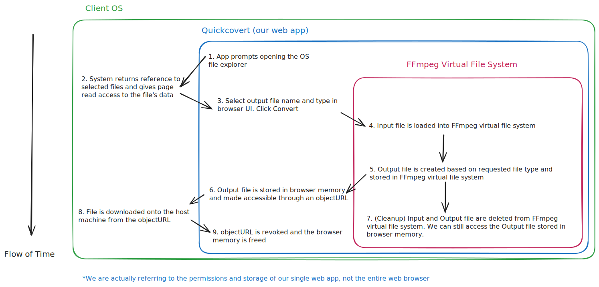

# Project 1: QuickConvert

## Project Links
* [Starter Code](https://github.com/CS61D/Project-Starter-QuickConvert)
* [Finished Solution](https://quickconvert.61d.org/)

## Project Overview

Whereas assignments are highly structured and guide you through the process of building an application in a specific way, projects challenge you apply what you know to build something from (almost) scratch. The actual features and requirements are specific and meant to mirror an existing application, but there are many ways to implement these features.Furthermore, the projects are meant to be applications which you might actually use yourself, instead of the application they are based on.

For Project 1, you will be creating an online image converter like [cloud convert](https://cloudconvert.com/). As such, we will call our application QuickConvert. While cloud convert and other file converters typically support documents, images, videos, and audio, the most common use case and only feature you will be implementing in this project is converting images from one format to another.

<details>
  <summary>
  Image Format Differences and Use Cases
  </summary>

  1. **JPEG**: The OG and most commonly used image format on the web. JPEGs have great compression, but the compression is lossy, meaning that some image quality is lost when the image is compressed. .jpg and .jpeg refers to the same format, but on older windows operating systems there was a cap of three characters for file extensions, so .jpeg was shortened to .jpg.
  2. **PNG**: Unlike JPEGs, PNGs use lossless compression, meaning that no detail is lost when converting from a different format to PNG. PNG images also support transparency, which JPEGs do not. The tradeoff is that PNGs are typically larger than JPEGs.
  3. **GIF**: GIFs allows for animations, but are limited to a 256 color palette, making them unsuitable for high detail photographs.
  4. **SVG**: SVGs are vector images, meaning that they are not made up of pixels, but of mathematically defined shapes and paths. This means that SVGs can be scaled to any size without losing quality. They are ideal for use as icons or logos, as they ensure consistent quality and sharpness no matter where they are displayed. It almost never makes sense to convert an non-SVG image to an SVG, but there are use cases where you might want to convert an SVG to a PNG or JPEG.
  5. **WebP**: WebP images are a newer format specifically optimized for the web. They are smaller than JPEGs and PNGs, and support both lossy and lossless compression, transparency, and are typically even smaller and more performant than JPEGs.
  <!-- 6. **Raw Formats (HEIC, RAW, etc.)**:  -->
</details>

One other difference between most online file converters and QuickConvert is that QuickConvert will do all image processing locally in the browser, and does not need to upload files to a server. This means that millions of people could use QuickConvert at the same time without any additional cost to you, since all of the processing will take place on their local machine. More practically, it allows you to build the application before we cover any backend concepts in the course.

### Working with FFmpeg in the Browser

[FFmpeg](https://www.youtube.com/watch?v=26Mayv5JPz0) is an open source tool for encode, decode, and transcode image, video, and audio files. For our purposes, it lets you convert images from one format to another.

However, as you might expect for a performance critical tool that is processing large video and image files, it is [written in C](https://github.com/FFmpeg/FFmpeg) and not in JavaScript, meaning we normally would not be able to execute it in the browser.

Fortunately, we can still use more performant code in the browser by using [WebAssembly](https://www.youtube.com/watch?v=cbB3QEwWMlA) (a.k.a WASM), which allows us to run executable code written in languages more performant than JavaScript, such as C, in the browser. We will be using a [WebAssembly build of FFmpeg](https://ffmpegwasm.netlify.app/) to handle the image conversion in QuickConvert.

For convenience and performance reasons, we will load the compiled WASM code into QuickConvert after our initial page renders. After loading the WASM code, we will have access to a `FFmpeg` object, which gives us a JavaScript API to interact with the underlying FFmpeg WASM code. We will store this in a [React ref](https://react.dev/reference/react/useRef) so that we can access it.

For your purposes, all you need to do is call this code snippet somewhere at the top of you application to load the FFmpeg code:

```typescript
// Will be null when not ready
import { useEffect, useRef } from "react";

// This ref will be passed into the convertFile function
const ffmpegRef = useRef<FFmpeg | null>(null);

useEffect(() => {
  load();
}, []);

const load = async () => {
  // the loadFfmpeg function is defined in lib/utils.ts
  const ffmpeg_response: FFmpeg = await loadFfmpeg();
  ffmpegRef.current = ffmpeg_response;
};
```

And then pass the ffmpegRef into the convertFile function (provided in starter code), when you want to actually execute a conversion.


### The File Conversion Data Pipeline

:::note
This section is mostly here to help explain the `convertFile` and `downloadFile` starter code functions, and give some context on where and when data is flowing to different places. Understanding this is not necessary to complete the project, and you are more than able to think of them as black boxes.
:::

Try clicking "Choose File" below and selecting an image file from your computer. Although this is just a basic HTML input element, our Dropzone component uses the same underlying primitives.

<input type="file"/> 

You will notice that the selected file appears in the browser almost instantly, no matter how large the file is. This is because nothing is actually done to the file at this point in time. You application is simply given permission to access the file, and can later read from it. 

But when is the data actually read, and how does FFmpeg interact with it? Let's walk through the process, and explain what the data looks like at each step.



[View Diagram In Excalidraw](https://excalidraw.com/#json=oEUfA-kZTG1P5DQoU35pe,r6h8IlNETQyRc0qxI-ioiw)

QuickConvert is running **within** the browser and host operating system. The WASM FFmpeg code is also running **within** QuickConvert, and has its own memory and virtual filesystem that is isolated from the rest of the browser. 

**File Select**: After opening the system file explorer, the user selects files from their computer. The files are represented as [File](https://developer.mozilla.org/en-US/docs/Web/API/File) objects, which contains the file's name, size, and other metadata. The file is not actually read at this point, but the browser has permission to read from it later.

```typescript title="Dropzone.tsx"
const { getRootProps, getInputProps } = useDropzone({
    onDrop: (files: File[]) => {
      console.log("Files dropped:", files);
      // Add files to state
    },
  });
```

**Loading and Converting**: After specifying our requested output settings and clicking the "Convert" button, we read the actual data of the file from the host OS, and then pass it to [FFmpeg's virtual filesystem](https://ffmpegwasm.netlify.app/playground#load-files-to-in-memory-file-system). The output of the conversion is also written to the virtual filesystem.
```typescript title="convertFile() in @lib/utils.ts"
// Read the file and write it to FFmpeg's virtual file system
await ffmpeg.writeFile(inputFullName, await fetchFile(file));
```

**Object URLs**: After the conversion is complete, we read the output file from the virtual filesystem into the browser memory, and create a [Blob](https://developer.mozilla.org/en-US/docs/Web/API/Blob) (essentially just a file) object from the data. We then create a [URL](https://developer.mozilla.org/en-US/docs/Web/API/URL) which can be used to access the file. Creating this URL pointing to the file ensures that the file remains in browser memory for as long as we need it.

```typescript
const data = await ffmpeg.readFile(outputFullName);

// Create a blob from the file data
const blob = new Blob([data], { type: `image/${outputFormat}` });

// Create an object URL
const url = URL.createObjectURL(blob);
```

**Downloading**: Once we have a url pointing to the file, we can download it back to the host OS. After downloading the file, we revoke the object URL, which tells the browser that it no longer needs to keep the file in memory.

## Starter Code
While the purpose of the project is to build something from scratch, we are providing you with some basic building blocks and abstractions, which let you focus on the core functionality of the application. You may change any of the starter code in any way you like, or choose to not use it at all.

### convertFile (in utils.ts)
The `convertFile` function takes in a File object, your FFmpeg ref, and the full output file name (including the extension). It uses FFmpeg to perform the conversion, and returns the outputted file name, size, and a blob object url. It is possible for the actual output file name to not be exactly the same as the provided output file name in case the provided name is not a valid file name.

### downloadFile (in utils.ts)
After converting a file, `downloadFile` takes in the blob object url and the output file name, and downloads the file to the user's computer. It does so by creating a link element and clicking it to download the file.

### formatFileSize (in utils.ts)
File sizes are stored as a number of bytes, but are typically displayed as a human readable string, such as "1.2 MB". The `formatFileSize` function takes a number of bytes and returns a human readable string.

### Dropzone.tsx
The Dropzone component has a minimally styled dropzone which uses the [react-dropzone](https://react-dropzone.js.org/) library to control its behaviors. It is already set up to only allow image files to be dropped. Besides editing the styling, you should only have to add code inside the `onDrop` function to handle uploaded files.

### constants.ts
This file contains the allowed file types for the dropzone, and a list of image formats that can be converted to. It is possible that FFmpeg supports more output formats than the ones in the file, but you will have to test this yourself if you want to add more formats.

### testFiles
These are just a few sample images you can use to test your application. You can use these or any other images you have on your computer.

### shadcn ui
The button, form, input, select, and label [shadcn components](https://ui.shadcn.com/) are already added to the project. You do not have to use these components, and you may also use any other shadcn components you would like using the shadcn cli.

```bash
bunx --bun shadcn@latest add toast # Adds toast component to your project
```

Also, included is a [loading spinner](https://shadcnui-expansions.typeart.cc/docs/spinner) from a shadcn expansion.

## Project Requirements

### File Input and Display
1. User may drag and drop or select multiple files to convert at once.
2. User must be able to add more files to convert after the initial files have been added.
3. All selected files must be displayed until they are cleared by the user. Both the file **name** and **size** should be displayed in a human readable form.
4. User must be able to remove a file from the list of files to convert.

### File Conversion
1. After selecting a file, user must be able to rename the file and select an jpeg, png, or webp output format before converting the file.
2. While a file is being converted, a loading spinner or some other indication of progress must be displayed.
3. After a file is converted, the user must be able to download the converted file. The downloaded file must match the name and format selected by the user.
4. After the file is converted, the user must be able to view the size of the newly created file.

## Tips
Managing multiple files adds a level of complexity. Start by building a complete implementation that works when processing one file at a time, and then worry about displaying and uploading multiple files at once.

The `File` objects that you receive from the dropzone have a `name` and `size` property. You will need to display both of these properties to the user.
<!-- ## Extensions
1. Convert file by URL
2. One click bulk convert
3. Copy created file to clipboard -->