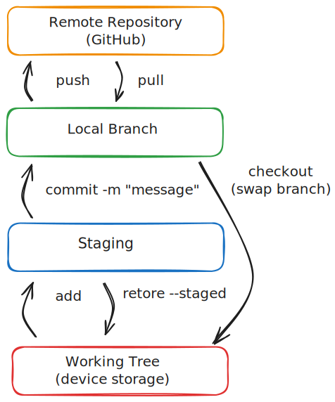

# Git & GitHub

> "git" can mean anything, depending on your mood.
>
> - random three-letter combination that is pronounceable, and not
>   actually used by any common UNIX command. The fact that it is a
>   mispronunciation of "get" may or may not be relevant.
> - stupid. contemptible and despicable. simple. Take your pick from the
>   dictionary of slang.
> - "global information tracker": you're in a good mood, and it actually
>   works for you. Angels sing, and a light suddenly fills the room.
> - "goddamn idiotic truckload of sh\*t": when it breaks

\- [Original Git README file](https://github.com/git/git/blob/fe5e7f332c8a95680a869eaca8033213676cbc7b/README)

> "I'm an egotistical bastard, so I name all my projects after myself. First Linux, now git."

\- Linus Torvalds, original author of git

## Git Overview

If you write code, using git is non-negotiable. In short, git allows you to keep track of different versions of your codebase, and helps your rectify differences between these versions. You can easily restore your codebase to a previous version (known as a commit), or work on multiple independent features at the same time on their own branches.

Additionally, git makes it feasible collaborate on projects with thousands of other developers. Each developer has a copy of the source code on their own local machine, and can make changes without needing to always be connected to a centralized server. When multiple developers have made changes to different pieces of the codebase, git can automatically merge these changes together.

Also checkout [Git in 100 seconds](https://www.youtube.com/watch?v=hwP7WQkmECE)

## A basic Git workflow



[View Diagram in
Excalidraw](https://excalidraw.com/#json=Va2FBPXIm34vDMfpI3Rfm,zgFdHBywozgTMfExv2mulw)

Once you have [created a git repository](#git-init---initialize-a-git-repository), git does not automatically start saving changes.The edits to files you have made which are just stored locally on your device and are not yet saved to git are called your **working tree**. To save these changes to git, we create what is called a commit.

Before creating a commit, we first must prepare it by specifying which changes from the working tree we want to save. We do this by adding the changes to the **staging area**. Once we have added all the changes we want to save to the staging area, we can create a commit with a message describing the changes made.

Finally, if our local repository is also hosted on GitHub (known as having a remote repository), we can push our changes to GitHub. This will make our changes available to other developers working on the project, who can pull in our changes to their local repository.

## Branches


### Merge conflicts

```
<<<<<<< HEAD
conflicting changes 1
=======
conflict changes 2
>>>>>>> conflict2
```

## Git versus GitHub

Git is the open source version control software which you just learned how to use. GitHub a hosting provider that allows you to store your git repositories in the cloud. GitLab and Bitbucket are other popular alternatives to GitHub, although they generally have a much smaller market share.

Since git repositories are almost always hosted on GitHub, it can be easy to confuse the two. GitHub layers features on top of git, which have become essential to the modern development workflow.

### Pull Requests

### Issues

### Code Reviews

### Actions

## Git Quick Reference

**Check out the [GitHub](https://education.github.com/git-cheat-sheet-education.pdf) and [GitLab](https://about.gitlab.com/images/press/git-cheat-sheet.pdf) official cheat sheets for a more comprehensive reference.**

### git init - Initialize (init) a git repository

If you are starting a new project, this is likely the first command you will run, unless you are [cloning](#git-clone---clone-a-remote-repository) an existing repository onto your local machine.

```bash
git init
```

### git status - Check the status of your repository

Shows you which files have been modified, which files are staged for commit, and which files are not tracked by git.

```bash
git status
```

### git add - Add files to the staging area

Files must be staged before they can be committed. Most often you will use `git add .` to add all files in the current directory.

```bash
git add . # Add all files in the current directory
git add file1.txt file2.txt # Add specific files
```

### git commit - Commit changes to the repository

Think of making a commit like **saving** your changes. At any point, you can revert back to a previous commit (or save) or jump between commits.

```bash
git commit -m "All commits must have a message"
```

Be sure to use descriptive commit messages so that it will be easy to understand what changes were made when looking back at the commit history.

### git remote add origin - Add a remote repository to existing local repository

Use this command you have a local repository, and want to push it to GitHub. First create the GitHub repository to get the remote URL, and then "add" the remote URL to your local repository so that you can "push" your changes to GitHub.

```bash
# Replace the URL with the URL of your repository
git remote add origin https://github.com/CS61D/my-repo.git
```

### git push - Push changes to a remote repository

If your local repository is also hosted on GitHub, this will push your local changes to GitHub. You may sometimes need to [pull](#git-pull---pull-changes-from-a-remote-repository) the latest changes from GitHub before you can push your changes.

```bash
git push origin main # Replace main with the branch you want to push to
```

### git clone - Clone a remote repository

If a repository is already hosted on GitHub, you can clone it to your local machine to be able to work on a local copy.

```bash
# Replace the URL with the URL of your repository
git clone https://github.com/CS61D/my-repo.git
```

### git pull - Pull changes from a remote repository

```bash
git pull origin main # Replace main with the branch you want to pull from
```

### git status - Check the status of your repository

Shows you which files have been modified, which files are staged for commit, and which files are not tracked by git.

```bash
git status
```

### git log - View the commit history

Each commit has a unique hash, a message, and the author. You can use the hash to revert back to a previous commit.

Sometimes you may see a full 40 character long git hash like `762d1585e4075dc8dcee917fc8727ea70365989f`, and other times you may see it truncated to just the first 7 characters like `762d158`. The full hash is always unique even across repositories. The shortened hashes are only unique within a single repository. You can typically just use the short hash to refer to a commit.

```bash
git log
git log --oneline # View a simplified log with only the shortened commit hash and message
```

### git branch - Create, list, or delete branches

```bash
git branch # List all branches
git branch new-branch # Create a new branch
git checkout -b new-branch # Create a new branch and switch to it
git branch -d branch-name # Delete a branch
```

### git checkout - Switch branches or view a previous commit

```bash
git checkout branch-name # Switch to a different branch

# Check out a new branch from a previous commit hash
# Find the hash of a commit by running `git log`
git checkout -b new-branch 762d158
```

### git restore - Discard changes in working directory or unstage files

```bash
git restore file.txt # Discard changes in file.txt. Revert contents back to last commit
git restore --staged file.txt # Unstage file.txt, undoing `git add`
```

Running `git restore` on a file is irreversible. An alternative is to `stash` the changes, which allows you to bring them back later.

### git stash - Temporarily store changes

```bash
git stash # Stash all uncommitted changes
git stash pop # Apply the most recent stash
git stash list # List all stashes
git stash push file1.txt # Stash only file1.txt
```

### git merge

Merge changes from one branch into another. If you make a [pull request](#pull-requests) on GitHub, then "merging" the pull request will automatically merge the changes from one branch into another, meaning you often do not have to run `git merge` locally.

```bash
# Merge other-branch into current branch
git merge other-branch -m "Merge commit message"
git merge other-branch --no-edit # Use default merge commit message (recommended)
```

(Todo talk about merge conflicts)

### git diff

View the difference between two commits. If you make a [pull request](#pull-requests) on GitHub, you will automatically be shown the differences between the two branches, meaning you often do not need to run this command locally.

```bash
git diff other-branch # View difference between current branch and other-branch
git diff other-branch file1.txt # View difference between current branch and other-branch only for file1.txt
```
