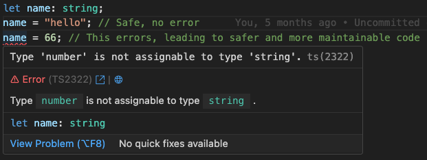

# TypeScript

## Links

- [TypeScript Lecture](https://www.youtube.com/watch?v=C3CzIBC5YwI)
- [TypeScript Lecture Code](https://github.com/CS61D/Lecture-TypeScript)

## Why TypeScript?

In [why JavaScript](javascript.md#why-javascript), we established that learning JavaScript is necessary for frontend, and a decent choice for backend. With that being said, dynamic typing is **terrible** for developer experience and productivity.

```javascript
const numberArray = [1, 2, 3, 4];
numberArray.push("five"); // Oops!
const doubled = numberArray.map((val) => val * 2);
// [ 2, 4, 6, 8, NaN ]
```

If we were using a statically types language, we would know for sure that our doubled array contains only numbers, and then could reason about it properly. So called _type errors_ are an entire class of bugs which only get worse as codebases expand in complexity.

We can't change the fundamental way that JavaScript executes in the browser or on the server (runtime), but we can mimic the guarantees of a statically typed language by adding types that are checked before at [compile time](../glossary.md#compile-time). JavaScript with the addition of types is called TypeScript, which has become the industry standard way of writing JavaScript.

## Primitive Types and Type Errors

The basic TypeScript types are strings, numbers, booleans, undefined, and null. These types can then be used in arrays and objects.

```typescript
let name: string = "Aidan";
let age: number = 21;
let isMale: boolean = true;
```

Once a variable is assigned a type, attempting to reassign it to a value of a different type will throw a type error.



Type errors appear interactively in your editor, but you can also run the TypeScript compiler from you terminal.

```bash
bunx tsc file.ts --noEmit # Individual file
bunx tsc --noEmit # Entire directory
```

## Typing Arrays, Objects, and Functions

Objects can be typed by specifying a type for each of their properties. Optional properties can be specified with a `?`. When an object is defined with a type, it must have all the properties of that type.

```typescript
export type Person = {
  name: string;
  age: number;
  grade?: number; // Optional type
  // equivalent to number | undefined
};
```

Object types can be also be extended to create new types based on existing types.

```typescript
// Inherit all of the fields of the Person type, and add a grade field
export type Student = Person & {
  grade: number;
};
```

Arrays can be typed by specifying the type of their elements in square brackets. Items accessed from the array will have the type of the array, and only items of the array type can be added to the array.

```typescript
let firstNames: string[] = ["Aidan", "Bob", "Charlie"];

// Alternate syntax
const lastNames: Array<string> = ["Smith", "Johnson", "Williams"];
```

Functions must have their input parameters typed, but the return type is _inferred_ by TypeScript. Even though we never specify the return type of `isOdd`, TypeScript can infer that it returns a boolean, meaning there is no type error when we assign the result to a boolean variable.

```typescript
const isOdd = (num: number) => {
  return num % 2 === 1;
};

const shouldContinue: boolean = isOdd(3);
```

While explicit function return types can be specified, doing so is actively harmful. If the explicitly specified return type of a function does not match the inferred return type, TypeScript will throw just one type error for the function. If the function is then used throughout you code base, the explicit return type will be used and later type errors will not be caught.

The only time you should specify a return type is when you are defining the parameters of a higher order function. This is so that TypeScript can infer the return type of the function passed to the higher order function.

```typescript
const transformOddStrings = (
  array: string[],
  func: (input: string) => string, // Higher order function must take and return a string
) => array.map((val, index) => (index % 2 == 1 ? func(val) : val));
```

## Unions and Type Inference

TypeScript types can be combined, such that a type is of one type _or_ another. These type unions are specified with the `|` operator.

```typescript
type Person = {
  name: string;
  age: number;
};

const birthdayWish = (person: Person | null) => {
  if (person === null) {
    return "Happy Birthday Stranger";
  }
  return `Happy ${person.age}th birthday ${person.name}`;
};
```

The above example also illustrates TypeScript's type inference. After the `if` statement has run, TypeScript has _narrowed_ the type of `Person | null` to just `Person`. This means that we can safely access the `name` and `age` properties of `person` without a type error.

Type unions are particularly useful when combined with type literals.

```typescript
// The role can not be any string, it must be one of the specified strings
type Roles = "Admin" | "Manager" | "User";

// Check if action is permitted based on user role and required role of action
const permittedRoles = (userRole: Roles, requiredRole: Roles) => {
  if (requiredRole === "User") {
    return true;
  }

  if (requiredRole === "Manager") {
    return userRole === "Manager" || userRole === "Admin";
  }

  return userRole === "Admin";
};
```

### Discriminated Unions

A particularly useful type of union is one where the type of the object can be determined by checking a common _discriminator_ key.

```typescript
// A 401 error means that the user is not authenticated (signed in)
// A 403 error means that the user does not have the required permission
// A 429 error means that the user has made too many requests and is being rate limited
type ErrorResponse =
  | {
      code: 401;
      message: string;
    }
  | {
      code: 403;
      message: string;
      requiredPermission: string;
    }
  | {
      code: 429;
      message: string;
      retryAfter: string;
    };

const handleError = (error: ErrorResponse) => {
  if (error.code === 403) {
    console.log(`You need permission ${error.requiredPermission}`);
  } else if (error.code === 429) {
    console.log(`Too many requests, try again at ${error.retryAfter}`);
  }

  // The message field is always present
  return error.message;
};
```

Arbitrarily large and complex unions of objects can be immediately narrowed down if they all share a unique discriminator key.

## Generics

Let's revisit some of the array functions we have been using. How would we implement our own version of the `map` function?

```typescript
const myMap = (array: number[], func: (val: number) => number) => {
  const result: number[] = [];
  for (const val of array) {
    result.push(func(val));
  }
  return result;
};
```

This implementation is fine, but it will throw a type error if we try and use an array of strings. How does the builtin `map` function handle this?

The answer is that it is a `generic` function. Generic functions essentially take a type as a parameter. This type can then be used throughout the function to ensure that the function is type safe.

```typescript
const myMapGeneric = <T>(array: T[], func: (val: T) => T) => {
  const result: T[] = [];
  for (const val of array) {
    result.push(func(val));
  }
  return result;
};

// This is okay. Our <T> type parameter is inferred to be number
const doubled = myMapGeneric([1, 2, 3, 4], (val) => val * 2);

// This is not okay because the generic Type must be the same for the array and the function
const doubledStrings = myMapGeneric([1, 2, 3, 4], (val) => val.toString());
```

<!-- TODO -->
<!-- ## Type Helpers (Omit, etc.) -->

## Unused TypeScript Features

There are several functionalities of TypeScript which we do not recommend using yourself, but which you still should be able to recognize if you see them in someone else' code.

_Interfaces_ are an alternative way of declaring types. They function almost the exact same as types, but have a slightly different syntax.

```typescript
interface PersonInterface {
  name: string;
  age: number;
}

// Extending an interface
interface EmployeeInterface extends PersonInterface {
  job: string;
}
```

_Enums_ are an alternative to type unions. They are a way of defining a set of named constants.

```typescript
enum Direction {
  Up,
  Down,
  Left,
  Right,
}

let go: Direction = Direction.Up;
```
